# 24.2.10 场景智能化升级功能架构图

## 系统概述
场景智能化升级功能通过集成先进的人工智能技术，实现数字人场景的智能化演进，包括智能对话、情感计算、个性化推荐、自适应学习等能力，提升用户体验和业务价值。

## 技术架构图

```mermaid
graph TB
    %% 智能感知层
    subgraph "智能感知层 (Intelligent Perception Layer)"
        A1[自然语言理解NLU]
        A2[语音识别ASR]
        A3[图像识别CV]
        A4[情感识别]
        A5[意图识别]
        A6[实体抽取]
        A7[上下文理解]
        A8[多模态融合]
    end

    %% 认知推理层
    subgraph "认知推理层 (Cognitive Reasoning Layer)"
        B1[知识图谱推理]
        B2[逻辑推理引擎]
        B3[因果推理]
        B4[常识推理]
        B5[类比推理]
        B6[归纳推理]
        B7[演绎推理]
        B8[概率推理]
    end

    %% 智能决策层
    subgraph "智能决策层 (Intelligent Decision Layer)"
        C1[决策树算法]
        C2[强化学习]
        C3[多臂老虎机]
        C4[贝叶斯决策]
        C5[博弈论算法]
        C6[优化算法]
        C7[策略梯度]
        C8[深度Q网络]
    end

    %% 个性化引擎层
    subgraph "个性化引擎层 (Personalization Engine Layer)"
        D1[用户画像构建]
        D2[行为预测模型]
        D3[偏好学习算法]
        D4[协同过滤]
        D5[内容推荐]
        D6[个性化对话]
        D7[动态适配]
        D8[A/B测试框架]
    end

    %% 学习进化层
    subgraph "学习进化层 (Learning Evolution Layer)"
        E1[在线学习算法]
        E2[增量学习]
        E3[迁移学习]
        E4[元学习]
        E5[联邦学习]
        E6[持续学习]
        E7[自监督学习]
        E8[对抗学习]
    end

    %% 内容生成层
    subgraph "内容生成层 (Content Generation Layer)"
        F1[文本生成GPT]
        F2[语音合成TTS]
        F3[图像生成GAN]
        F4[视频生成]
        F5[3D内容生成]
        F6[创意内容生成]
        F7[多模态生成]
        F8[风格迁移]
    end

    %% 交互优化层
    subgraph "交互优化层 (Interaction Optimization Layer)"
        G1[对话策略优化]
        G2[响应时间优化]
        G3[交互流程优化]
        G4[用户体验优化]
        G5[情感表达优化]
        G6[个性化界面]
        G7[多轮对话管理]
        G8[上下文管理]
    end

    %% AI模型管理层
    subgraph "AI模型管理层 (AI Model Management Layer)"
        H1[模型训练平台]
        H2[模型版本管理]
        H3[模型部署服务]
        H4[模型监控]
        H5[模型评估]
        H6[模型优化]
        H7[AutoML平台]
        H8[模型市场]
    end

    %% 数据智能层
    subgraph "数据智能层 (Data Intelligence Layer)"
        I1[数据挖掘]
        I2[特征工程]
        I3[数据标注]
        I4[数据增强]
        I5[数据质量评估]
        I6[知识抽取]
        I7[智能标签]
        I8[数据洞察]
    end

    %% 基础设施层
    subgraph "基础设施层 (Infrastructure Layer)"
        J1[GPU集群\nNVIDIA/AMD]
        J2[TPU集群\nGoogle TPU]
        J3[分布式计算\nSpark/Ray]
        J4[深度学习框架\nTensorFlow/PyTorch]
        J5[模型服务\nTensorFlow Serving]
        J6[容器编排\nKubernetes]
        J7[云原生AI\nKubeflow]
        J8[边缘计算\nEdge AI]
    end

    %% 连接关系
    A1 --> B1
    A2 --> B2
    A3 --> B3
    A4 --> B4
    A5 --> B5
    A6 --> B6
    A7 --> B7
    A8 --> B8
    
    B1 --> C1
    B2 --> C2
    B3 --> C3
    B4 --> C4
    B5 --> C5
    B6 --> C6
    B7 --> C7
    B8 --> C8
    
    C1 --> D1
    C2 --> D2
    C3 --> D3
    C4 --> D4
    C5 --> D5
    C6 --> D6
    C7 --> D7
    C8 --> D8
    
    D1 --> E1
    D2 --> E2
    D3 --> E3
    D4 --> E4
    D5 --> E5
    D6 --> E6
    D7 --> E7
    D8 --> E8
    
    E1 --> F1
    E2 --> F2
    E3 --> F3
    E4 --> F4
    E5 --> F5
    E6 --> F6
    E7 --> F7
    E8 --> F8
    
    F1 --> G1
    F2 --> G2
    F3 --> G3
    F4 --> G4
    F5 --> G5
    F6 --> G6
    F7 --> G7
    F8 --> G8
    
    G1 --> H1
    G2 --> H2
    G3 --> H3
    G4 --> H4
    G5 --> H5
    G6 --> H6
    G7 --> H7
    G8 --> H8
    
    H1 --> I1
    H2 --> I2
    H3 --> I3
    H4 --> I4
    H5 --> I5
    H6 --> I6
    H7 --> I7
    H8 --> I8
    
    A1 --> J1
    B1 --> J2
    C2 --> J3
    E1 --> J4
    F1 --> J5
    H3 --> J6
    H1 --> J7
    G1 --> J8

    %% 样式定义
    classDef perception fill:#e3f2fd
    classDef reasoning fill:#f3e5f5
    classDef decision fill:#e8f5e8
    classDef personalization fill:#fff3e0
    classDef learning fill:#fce4ec
    classDef generation fill:#f1f8e9
    classDef interaction fill:#e0f2f1
    classDef modelmanagement fill:#fff8e1
    classDef dataintelligence fill:#ffebee
    classDef infrastructure fill:#f5f5f5

    class A1,A2,A3,A4,A5,A6,A7,A8 perception
    class B1,B2,B3,B4,B5,B6,B7,B8 reasoning
    class C1,C2,C3,C4,C5,C6,C7,C8 decision
    class D1,D2,D3,D4,D5,D6,D7,D8 personalization
    class E1,E2,E3,E4,E5,E6,E7,E8 learning
    class F1,F2,F3,F4,F5,F6,F7,F8 generation
    class G1,G2,G3,G4,G5,G6,G7,G8 interaction
    class H1,H2,H3,H4,H5,H6,H7,H8 modelmanagement
    class I1,I2,I3,I4,I5,I6,I7,I8 dataintelligence
    class J1,J2,J3,J4,J5,J6,J7,J8 infrastructure
```

## 核心功能模块

### 1. 智能感知能力
- **多模态理解**: 文本、语音、图像、视频的统一理解
- **情感计算**: 用户情感状态识别和分析
- **意图识别**: 深度理解用户真实意图
- **上下文感知**: 全局上下文理解和记忆

### 2. 认知推理能力
- **知识推理**: 基于知识图谱的智能推理
- **逻辑推理**: 复杂逻辑关系推理
- **常识推理**: 基于常识的智能判断
- **因果推理**: 因果关系分析和推理

### 3. 智能决策能力
- **策略学习**: 通过强化学习优化决策策略
- **多目标决策**: 平衡多个目标的最优决策
- **实时决策**: 毫秒级智能决策响应
- **自适应决策**: 根据环境变化自适应调整

### 4. 个性化服务
- **用户画像**: 多维度用户特征建模
- **个性化推荐**: 基于深度学习的推荐算法
- **动态适配**: 实时适配用户偏好变化
- **场景个性化**: 不同场景下的个性化服务

## 智能化升级路径

## 大语言模型集成

### 1. LLM架构设计

### 2. 提示工程优化
- **提示模板设计**: 针对不同任务的提示模板
- **少样本学习**: Few-shot和Zero-shot学习
- **链式思维**: Chain-of-Thought推理
- **自一致性**: Self-Consistency验证

### 3. 模型安全与对齐
- **内容安全**: 有害内容过滤和检测
- **价值对齐**: 模型输出与人类价值观对齐
- **偏见消除**: 减少模型偏见和歧视
- **可解释性**: 提高模型决策的可解释性

## 多模态AI集成

### 1. 多模态融合架构

### 2. 跨模态学习
- **模态对齐**: 不同模态的语义对齐
- **模态转换**: 跨模态内容生成和转换
- **模态补全**: 缺失模态的智能补全
- **模态增强**: 多模态信息互相增强

## 强化学习应用

### 1. RL在对话系统中的应用

### 2. 多智能体协作
- **分布式决策**: 多个智能体协同决策
- **角色分工**: 不同智能体承担不同角色
- **知识共享**: 智能体间知识和经验共享
- **协调机制**: 智能体间协调和冲突解决

## 知识图谱增强

### 1. 知识图谱构建

### 2. 知识推理应用
- **路径推理**: 基于图路径的推理
- **规则推理**: 基于逻辑规则的推理
- **嵌入推理**: 基于知识嵌入的推理
- **神经推理**: 基于神经网络的推理

### 3. 知识图谱更新
- **增量更新**: 新知识的增量添加
- **知识验证**: 知识的准确性验证
- **知识进化**: 知识的动态演化
- **版本管理**: 知识图谱版本控制

## 个性化推荐系统

### 1. 推荐算法融合

### 2. 实时个性化
- **实时特征**: 实时用户行为特征提取
- **在线学习**: 在线模型更新和学习
- **冷启动**: 新用户和新物品冷启动
- **多样性**: 推荐结果多样性保障

## 情感智能计算

### 1. 情感识别技术
- **文本情感分析**: 基于NLP的情感识别
- **语音情感识别**: 基于声学特征的情感识别
- **视觉情感识别**: 基于面部表情的情感识别
- **多模态情感融合**: 多模态情感信息融合

### 2. 情感生成技术
- **情感化文本生成**: 带有情感色彩的文本生成
- **情感化语音合成**: 情感丰富的语音合成
- **情感化表情生成**: 数字人表情情感化
- **情感化动作生成**: 肢体动作情感表达

### 3. 情感交互优化
- **情感状态跟踪**: 用户情感状态持续跟踪
- **情感响应策略**: 针对不同情感的响应策略
- **情感调节**: 积极情感引导和负面情感缓解
- **情感记忆**: 用户情感历史记忆和利用

## 持续学习机制

### 1. 在线学习框架

### 2. 学习策略
- **主动学习**: 主动选择有价值的样本学习
- **元学习**: 学习如何更好地学习
- **迁移学习**: 跨领域知识迁移
- **联邦学习**: 分布式协作学习

### 3. 知识蒸馏
- **模型压缩**: 大模型知识蒸馏到小模型
- **知识传递**: 教师模型向学生模型传递知识
- **多任务蒸馏**: 多任务知识统一蒸馏
- **在线蒸馏**: 实时知识蒸馏更新

## 性能优化策略

### 1. 推理加速
- **模型量化**: INT8/FP16量化减少计算量
- **模型剪枝**: 移除冗余参数提升速度
- **知识蒸馏**: 轻量化模型部署
- **动态推理**: 根据输入复杂度动态调整

### 2. 分布式计算
- **模型并行**: 大模型分布式并行推理
- **数据并行**: 批量数据并行处理
- **流水线并行**: 推理流水线并行
- **异构计算**: CPU/GPU/TPU协同计算

### 3. 缓存优化
- **结果缓存**: 推理结果智能缓存
- **特征缓存**: 中间特征缓存复用
- **模型缓存**: 热点模型内存缓存
- **预计算**: 高频查询预计算

## 技术特性

### 智能化水平
- 接近人类水平的理解能力
- 创造性内容生成能力
- 情感智能交互能力
- 自主学习进化能力

### 适应性强
- 快速适应新领域新任务
- 个性化服务能力
- 多场景灵活切换
- 持续优化改进

### 扩展性好
- 模块化AI能力组合
- 插件式算法扩展
- 云边协同部署
- 弹性资源调度

### 可信赖性
- AI决策可解释
- 内容安全可控
- 隐私保护机制
- 伦理道德约束