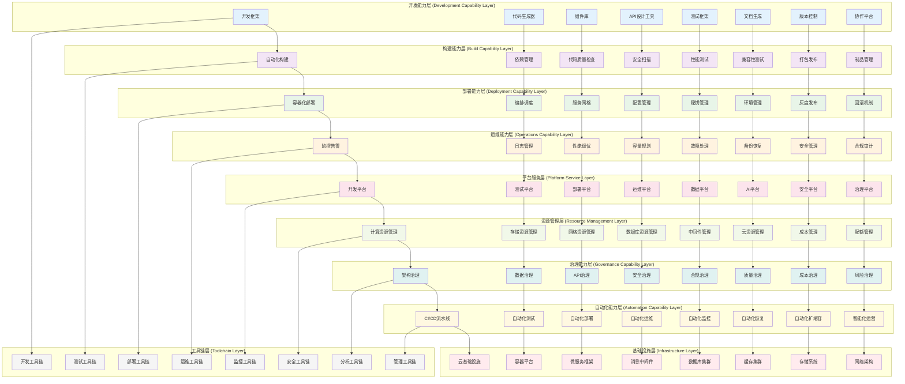
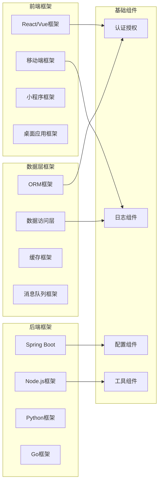
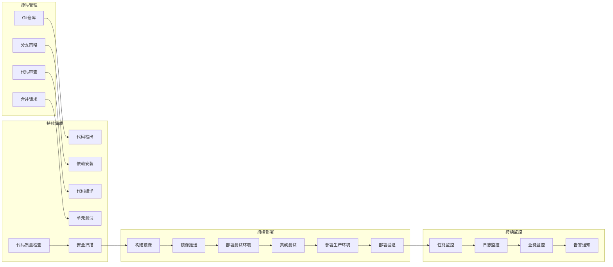
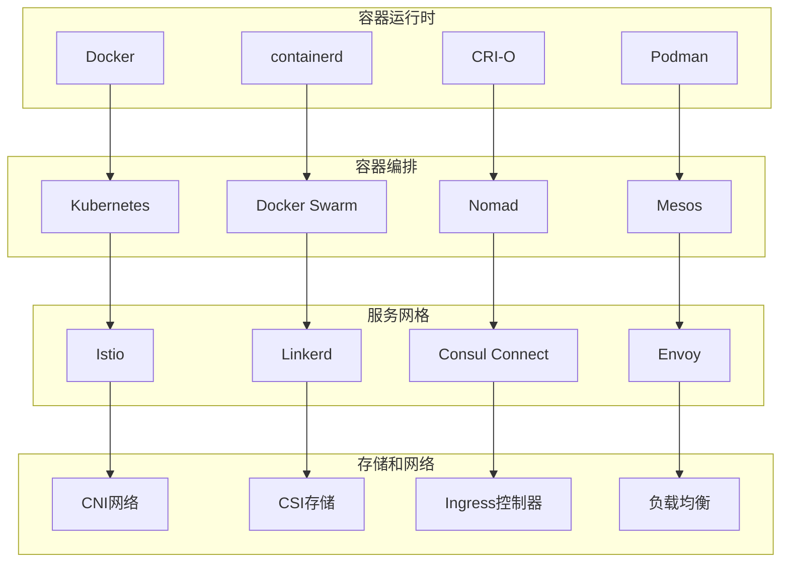
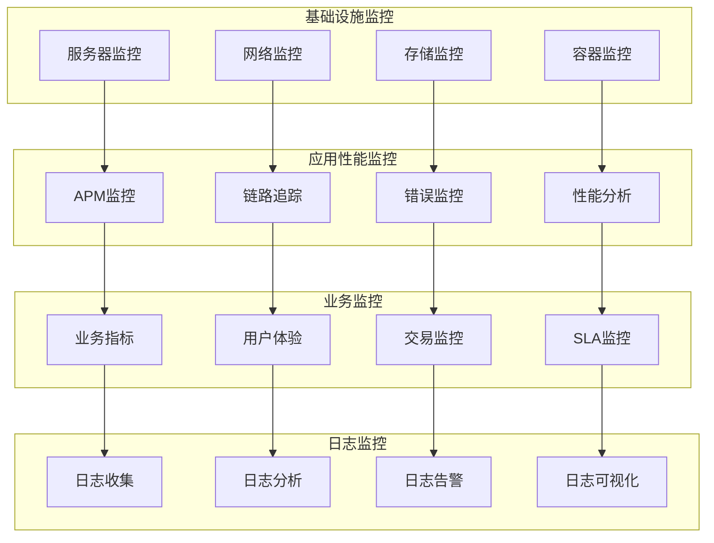
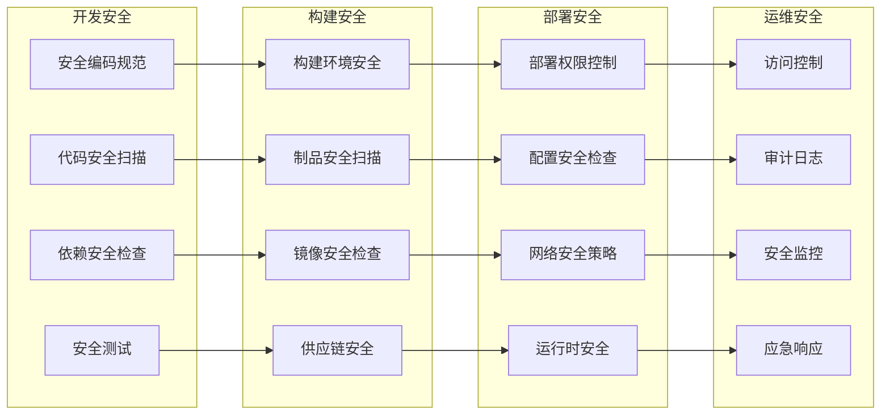
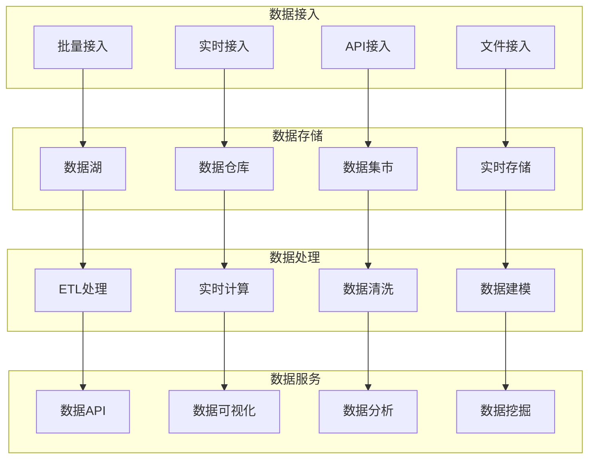

# 24.2.11 系统建设能力功能架构图

## 系统概述
系统建设能力功能架构为数字人项目提供全方位的系统建设、管理和运维能力，包括开发框架、部署平台、运维工具、监控体系等，确保系统的高效开发、稳定运行和持续演进。

## 技术架构图

## 核心功能模块

### 1. 开发能力建设
- **统一开发框架**: 标准化的开发框架和脚手架
- **低代码平台**: 可视化开发和快速原型构建
- **组件化开发**: 可复用的组件库和模块
- **API优先设计**: API设计优先的开发模式

### 2. 自动化构建体系
- **持续集成**: 代码提交自动触发构建流程
- **质量门禁**: 自动化代码质量检查和门禁
- **多环境构建**: 支持多环境的差异化构建
- **制品管理**: 构建产物的版本管理和分发

### 3. 智能部署平台
- **容器化部署**: 基于容器的标准化部署
- **多云部署**: 支持多云环境的统一部署
- **蓝绿部署**: 零停机的部署策略
- **自动回滚**: 部署失败的自动回滚机制

### 4. 全方位运维体系
- **智能监控**: AI驱动的智能监控和预警
- **自动化运维**: 运维任务的自动化执行
- **故障自愈**: 常见故障的自动修复
- **性能优化**: 基于监控数据的性能调优

## 开发能力架构

### 1. 开发框架体系

### 2. 低代码开发平台
- **可视化设计器**: 拖拽式界面设计
- **业务流程编排**: 可视化业务流程配置
- **数据模型设计**: 图形化数据模型设计
- **代码生成**: 自动生成标准化代码

### 3. 组件库建设
- **UI组件库**: 标准化的UI组件
- **业务组件库**: 业务场景组件
- **工具组件库**: 通用工具组件
- **第三方集成组件**: 第三方服务集成组件

## CI/CD流水线设计

### 1. 流水线架构

### 2. 质量门禁机制
- **代码规范检查**: 代码风格和规范检查
- **单元测试覆盖率**: 最低测试覆盖率要求
- **安全漏洞扫描**: 安全漏洞自动检测
- **性能基准测试**: 性能回归检测

### 3. 部署策略
- **蓝绿部署**: 零停机部署策略
- **金丝雀发布**: 渐进式发布验证
- **滚动更新**: 逐步替换实例
- **A/B测试**: 版本效果对比测试

## 云原生架构

### 1. 容器化平台

### 2. 微服务架构
- **服务拆分**: 按业务领域拆分微服务
- **服务治理**: 服务注册、发现、配置管理
- **API网关**: 统一的API入口和管理
- **分布式事务**: 跨服务的事务一致性

### 3. 云原生存储
- **对象存储**: 海量非结构化数据存储
- **块存储**: 高性能块级别存储
- **文件存储**: 共享文件系统存储
- **数据库服务**: 托管数据库服务

## 监控运维体系

### 1. 多层次监控

### 2. 智能运维
- **AIOps平台**: AI驱动的运维自动化
- **异常检测**: 基于机器学习的异常检测
- **根因分析**: 自动化的故障根因分析
- **预测性维护**: 基于数据的预测性维护

### 3. 自动化运维
- **自动化部署**: 应用和基础设施自动化部署
- **自动化扩缩容**: 根据负载自动扩缩容
- **自动化备份**: 数据自动备份和恢复
- **自动化巡检**: 系统健康状态自动巡检

## 安全能力建设

### 1. DevSecOps集成

### 2. 安全防护体系
- **身份认证**: 多因子身份认证
- **访问控制**: 基于角色的访问控制
- **数据保护**: 数据加密和脱敏
- **网络安全**: 网络隔离和防护

### 3. 合规管理
- **合规框架**: 建立合规管理框架
- **合规检查**: 自动化合规检查
- **合规报告**: 合规状态报告
- **合规培训**: 定期合规培训

## 数据能力平台

### 1. 数据平台架构

### 2. 数据治理
- **数据标准**: 建立统一的数据标准
- **数据质量**: 数据质量监控和管理
- **数据安全**: 数据分类分级和保护
- **数据生命周期**: 数据全生命周期管理

## 成本优化管理

### 1. 成本可视化
- **资源成本**: 各类资源的成本统计
- **项目成本**: 按项目维度的成本分析
- **部门成本**: 按部门维度的成本分摊
- **趋势分析**: 成本趋势分析和预测

### 2. 成本优化策略
- **资源优化**: 闲置资源回收和优化
- **规格优化**: 资源规格合理化调整
- **时间优化**: 按需使用和定时调度
- **架构优化**: 架构层面的成本优化

### 3. 成本控制
- **预算管理**: 成本预算制定和管理
- **配额限制**: 资源使用配额限制
- **告警机制**: 成本异常告警
- **审批流程**: 资源申请审批流程

## 技术特性

### 高效开发
- 标准化开发框架
- 自动化代码生成
- 可视化开发工具
- 组件化复用机制

### 敏捷交付
- 持续集成部署
- 自动化测试验证
- 多环境管理
- 快速回滚机制

### 智能运维
- AI驱动的运维
- 自动化故障处理
- 预测性维护
- 智能资源调度

### 安全合规
- 全流程安全保障
- 自动化合规检查
- 数据安全保护
- 审计追踪机制

### 成本可控
- 资源成本透明
- 智能成本优化
- 预算管控机制
- ROI量化分析