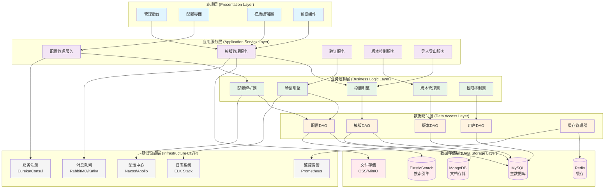
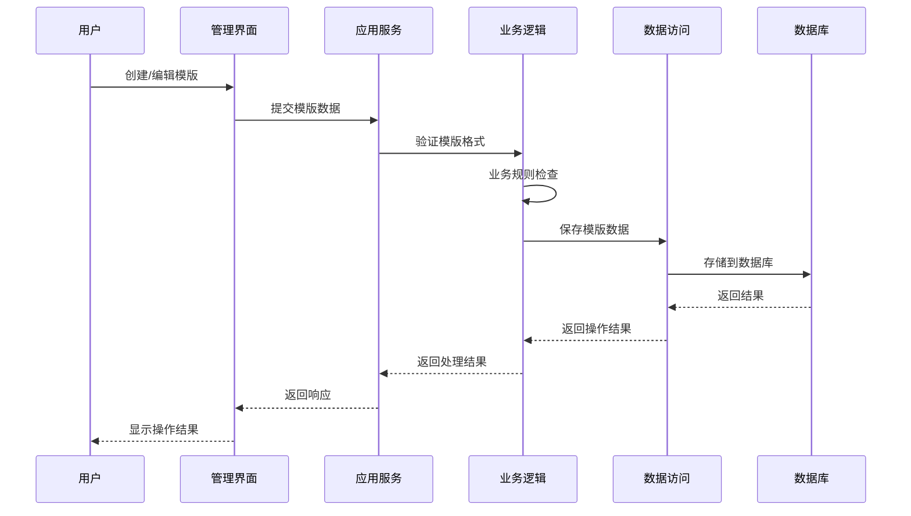
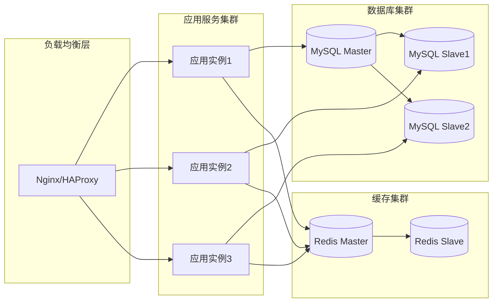

# 24.2.1 模版及基础信息配置管理功能架构图

## 系统概述
模版及基础信息配置管理功能负责数字人系统的基础配置、模版管理和元数据管理，为整个系统提供基础数据支撑。

## 技术架构图

## 核心功能模块

### 1. 模版管理模块
- **模版创建**: 支持多种类型模版创建（文本、图片、视频、音频）
- **模版编辑**: 可视化编辑器，支持拖拽操作
- **模版分类**: 按业务场景、用途、类型分类管理
- **模版版本**: 支持版本控制和回滚机制

### 2. 配置管理模块
- **系统配置**: 全局系统参数配置
- **业务配置**: 各业务模块专属配置
- **环境配置**: 开发、测试、生产环境配置隔离
- **动态配置**: 支持热更新，无需重启

### 3. 验证服务模块
- **格式验证**: 配置格式和模版格式验证
- **业务规则验证**: 业务逻辑合规性检查
- **依赖关系验证**: 配置间依赖关系检查
- **权限验证**: 操作权限和数据权限验证

### 4. 版本控制模块
- **版本记录**: 记录所有变更历史
- **差异对比**: 版本间差异可视化对比
- **回滚机制**: 支持一键回滚到历史版本
- **分支管理**: 支持配置分支和合并

## 技术特性

### 高可用性
- 主从数据库架构
- Redis集群缓存
- 服务熔断和降级
- 自动故障切换

### 高性能
- 多级缓存策略
- 数据库读写分离
- 异步处理机制
- CDN加速静态资源

### 安全性
- 多层权限控制
- 数据加密存储
- 操作审计日志
- 敏感信息脱敏

### 扩展性
- 微服务架构
- 水平扩展支持
- 插件化设计
- API标准化

## 数据流图

## 部署架构

