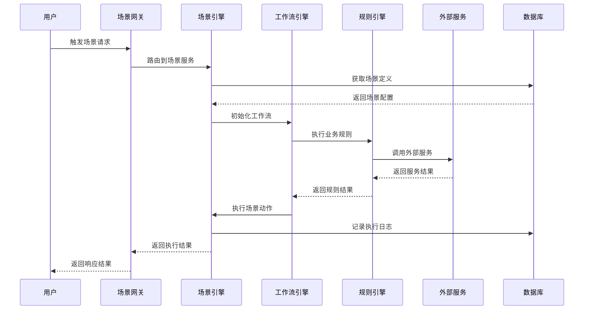
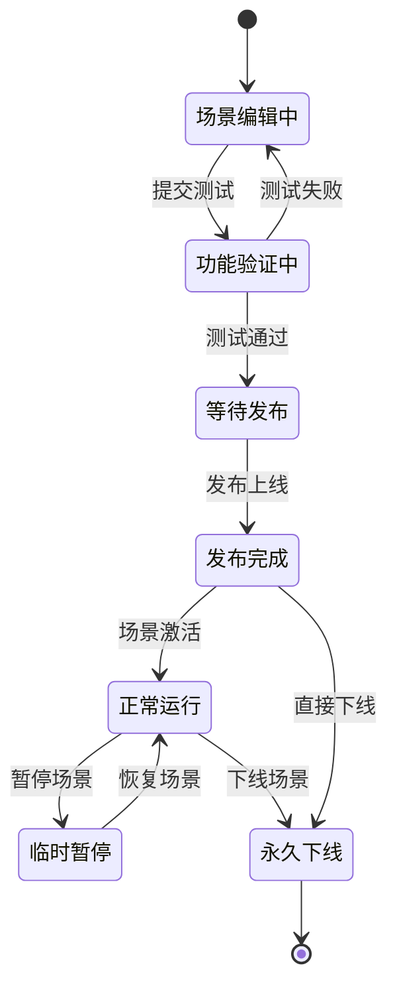
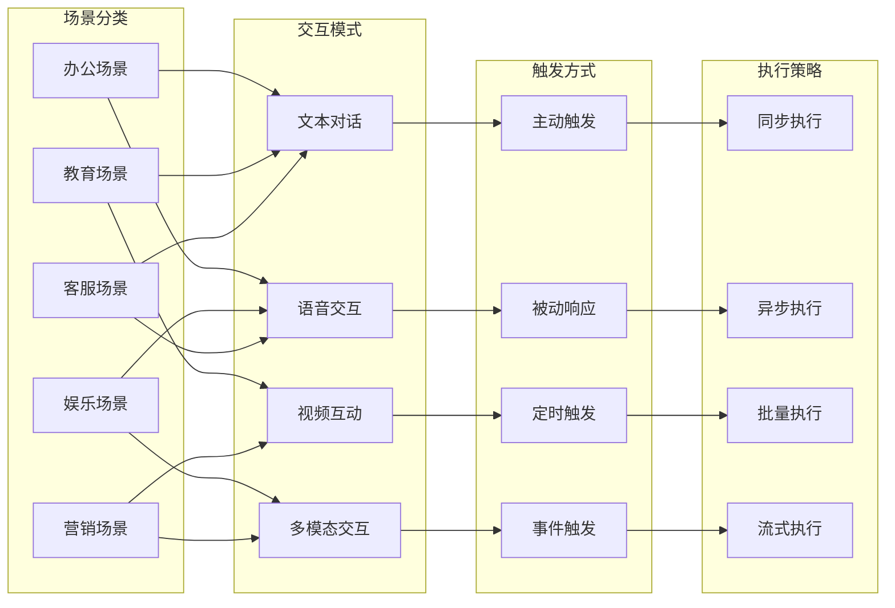
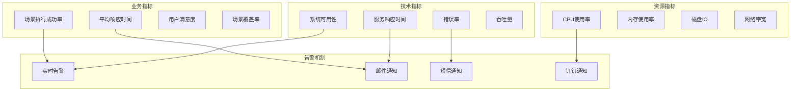

# 24.2.2 场景管理功能架构图

## 系统概述
场景管理功能负责数字人系统中各种业务场景的创建、编排、管理和执行，是数字人智能交互的核心引擎。

## 技术架构图

```mermaid
graph TB
    %% 表现层
    subgraph "表现层 (Presentation Layer)"
        A1[场景设计器]
        A2[场景监控台]
        A3[场景测试工具]
        A4[场景发布平台]
        A5[移动端管理]
    end

    %% 网关层
    subgraph "网关层 (Gateway Layer)"
        B1[API网关]
        B2[认证网关]
        B3[流量控制]
        B4[协议转换]
    end

    %% 应用服务层
    subgraph "应用服务层 (Application Service Layer)"
        C1[场景编排服务]
        C2[场景执行服务]
        C3[场景生命周期管理]
        C4[场景版本管理]
        C5[场景调度服务]
        C6[场景监控服务]
    end

    %% 核心引擎层
    subgraph "核心引擎层 (Core Engine Layer)"
        D1[工作流引擎]
        D2[规则引擎]
        D3[事件引擎]
        D4[状态机引擎]
        D5[决策引擎]
        D6[场景解析器]
    end

    %% 业务逻辑层
    subgraph "业务逻辑层 (Business Logic Layer)"
        E1[场景模型管理]
        E2[节点处理器]
        E3[条件判断器]
        E4[动作执行器]
        E5[数据流处理]
        E6[异常处理器]
    end

    %% 数据访问层
    subgraph "数据访问层 (Data Access Layer)"
        F1[场景定义DAO]
        F2[执行记录DAO]
        F3[用户行为DAO]
        F4[配置数据DAO]
        F5[缓存管理器]
    end

    %% 数据存储层
    subgraph "数据存储层 (Data Storage Layer)"
        G1[(MySQL\n关系数据库)]
        G2[(MongoDB\n文档数据库)]
        G3[(Redis\n内存数据库)]
        G4[(InfluxDB\n时序数据库)]
        G5[文件存储\nHDFS/OSS]
    end

    %% 外部服务层
    subgraph "外部服务层 (External Services)"
        H1[AI/NLP服务]
        H2[语音识别服务]
        H3[图像识别服务]
        H4[推荐算法服务]
        H5[第三方API]
    end

    %% 基础设施层
    subgraph "基础设施层 (Infrastructure Layer)"
        I1[消息队列\nKafka/RocketMQ]
        I2[任务调度\nXXL-Job]
        I3[配置中心\nNacos]
        I4[服务发现\nConsul]
        I5[监控告警\nPrometheus]
        I6[链路追踪\nJaeger]
    end

    %% 连接关系
    A1 --> B1
    A2 --> B1
    A3 --> B1
    A4 --> B1
    A5 --> B2
    
    B1 --> C1
    B2 --> C2
    B3 --> C3
    B4 --> C4
    
    C1 --> D1
    C2 --> D2
    C3 --> D3
    C4 --> D4
    C5 --> D5
    C6 --> D6
    
    D1 --> E1
    D2 --> E2
    D3 --> E3
    D4 --> E4
    D5 --> E5
    D6 --> E6
    
    E1 --> F1
    E2 --> F2
    E3 --> F3
    E4 --> F4
    E5 --> F5
    E6 --> F1
    
    F1 --> G1
    F2 --> G2
    F3 --> G3
    F4 --> G4
    F5 --> G5
    
    D2 --> H1
    D3 --> H2
    D4 --> H3
    D5 --> H4
    E4 --> H5
    
    C5 --> I1
    C6 --> I2
    D1 --> I3
    C1 --> I4
    E6 --> I5
    C2 --> I6

    %% 样式定义
    classDef presentation fill:#e3f2fd
    classDef gateway fill:#f3e5f5
    classDef application fill:#e8f5e8
    classDef engine fill:#fff3e0
    classDef business fill:#fce4ec
    classDef dataaccess fill:#f1f8e9
    classDef storage fill:#ffebee
    classDef external fill:#e0f2f1
    classDef infrastructure fill:#f5f5f5

    class A1,A2,A3,A4,A5 presentation
    class B1,B2,B3,B4 gateway
    class C1,C2,C3,C4,C5,C6 application
    class D1,D2,D3,D4,D5,D6 engine
    class E1,E2,E3,E4,E5,E6 business
    class F1,F2,F3,F4,F5 dataaccess
    class G1,G2,G3,G4,G5 storage
    class H1,H2,H3,H4,H5 external
    class I1,I2,I3,I4,I5,I6 infrastructure
```

## 核心功能模块

### 1. 场景设计与编排
- **可视化设计器**: 拖拽式场景流程设计
- **节点库管理**: 预定义节点组件库
- **流程编排**: 复杂业务流程编排
- **条件分支**: 多条件判断和分支处理

### 2. 场景执行引擎
- **实时执行**: 场景实时执行和状态管理
- **并发控制**: 多场景并发执行控制
- **异常处理**: 执行异常捕获和恢复
- **性能优化**: 执行性能监控和优化

### 3. 场景生命周期管理
- **创建阶段**: 场景创建和初始化
- **测试阶段**: 场景测试和验证
- **发布阶段**: 场景发布和部署
- **运行阶段**: 场景运行监控
- **下线阶段**: 场景下线和归档

### 4. 智能决策模块
- **规则引擎**: 业务规则配置和执行
- **机器学习**: 智能推荐和预测
- **A/B测试**: 场景效果对比测试
- **动态优化**: 场景动态调整和优化

## 场景执行流程图

## 场景状态机图

## 场景类型架构

## 性能优化策略

### 1. 缓存策略
- **场景定义缓存**: 热点场景定义缓存
- **执行结果缓存**: 相同输入结果缓存
- **用户状态缓存**: 用户会话状态缓存
- **规则缓存**: 业务规则结果缓存

### 2. 并发优化
- **异步处理**: 非关键路径异步处理
- **线程池管理**: 合理配置线程池
- **资源隔离**: 不同场景资源隔离
- **限流保护**: 请求限流和熔断

### 3. 数据优化
- **读写分离**: 数据库读写分离
- **分库分表**: 大数据量分库分表
- **索引优化**: 查询索引优化
- **数据压缩**: 存储数据压缩

## 监控指标体系

