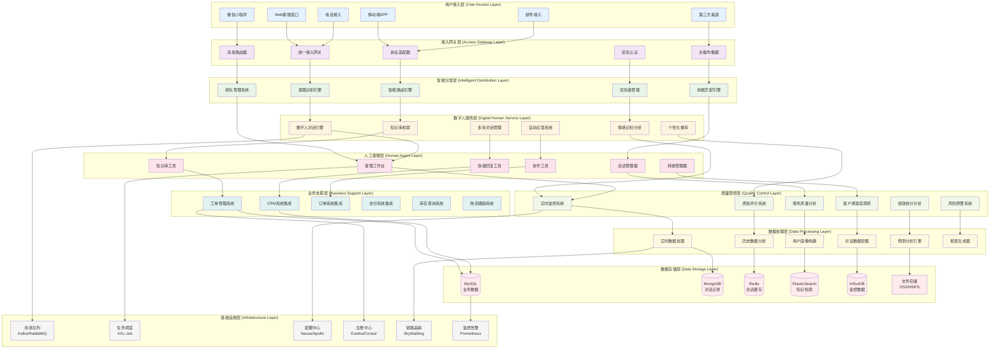
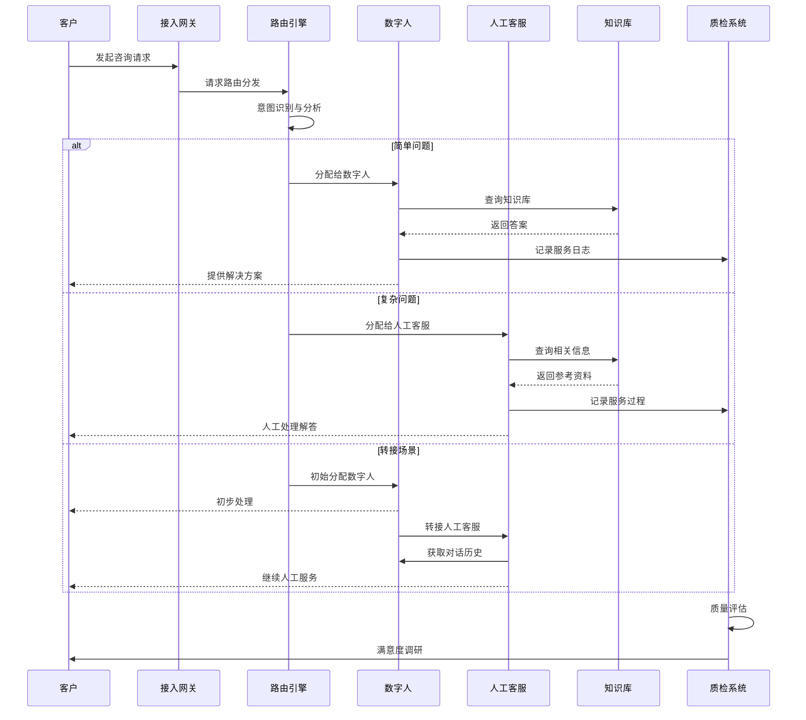
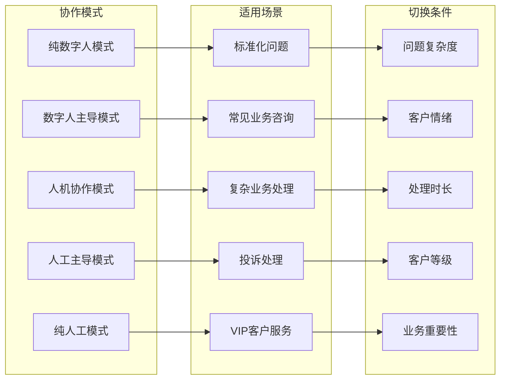
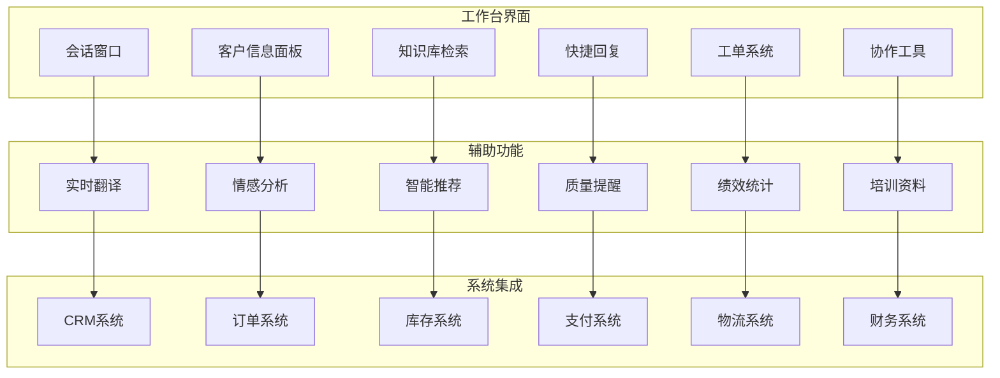
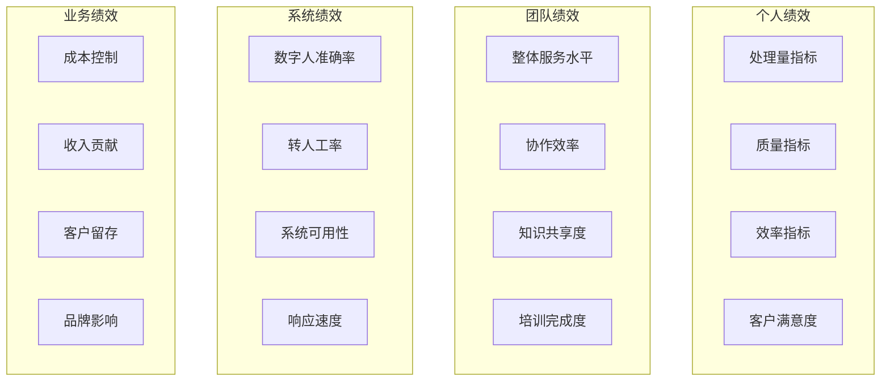

# 24.2.3 真人驱动及客服常用功能建设功能架构图

## 系统概述
真人驱动及客服常用功能建设模块实现数字人与真人客服的无缝协作，提供智能客服、人工接入、质量监控等完整的客服解决方案。

## 技术架构图

## 核心功能模块

### 1. 智能路由分发
- **意图识别**: NLP技术识别用户真实意图
- **技能匹配**: 根据问题类型匹配最适合的服务方式
- **负载均衡**: 智能分配客服资源，避免过载
- **优先级管理**: VIP客户、紧急问题优先处理

### 2. 数字人智能客服
- **自然语言理解**: 准确理解用户问题和需求
- **知识库检索**: 快速检索相关知识和解决方案
- **多轮对话**: 支持复杂的多轮对话交互
- **情感识别**: 识别用户情绪，调整服务策略

### 3. 人工客服协作
- **无缝转接**: 数字人到人工客服的平滑转接
- **上下文传递**: 完整传递对话历史和用户信息
- **协同工作**: 人工客服与数字人协同处理复杂问题
- **专家咨询**: 疑难问题快速接入专家支持

### 4. 质量监控体系
- **实时监控**: 对话质量实时监控和预警
- **自动质检**: AI辅助质检，提高质检效率
- **客户满意度**: 自动收集和分析客户反馈
- **绩效分析**: 多维度服务绩效统计分析

## 服务流程图

## 人机协作模式

## 客服工作台架构

## 质量管控体系

### 1. 实时监控指标
- **响应时长**: 首次响应时间和平均处理时间
- **解决率**: 一次性解决率和最终解决率
- **客户满意度**: 实时满意度评分
- **服务质量**: 服务规范性和专业度评估

### 2. 智能质检系统
- **关键词监控**: 敏感词汇和禁用语检测
- **情绪监控**: 客户和客服情绪变化监控
- **流程合规**: 服务流程规范性检查
- **知识准确性**: 回答内容准确性验证

### 3. 绩效评估体系

## 技术特性

### 高并发处理
- 支持万级并发会话
- 弹性扩缩容机制
- 智能负载均衡
- 资源池动态调配

### 多渠道统一
- 全渠道接入统一
- 会话状态同步
- 客户身份识别
- 服务记录整合

### 智能化程度
- 深度学习算法
- 自然语言处理
- 情感计算分析
- 个性化推荐

### 安全保障
- 数据传输加密
- 敏感信息脱敏
- 访问权限控制
- 操作审计追踪