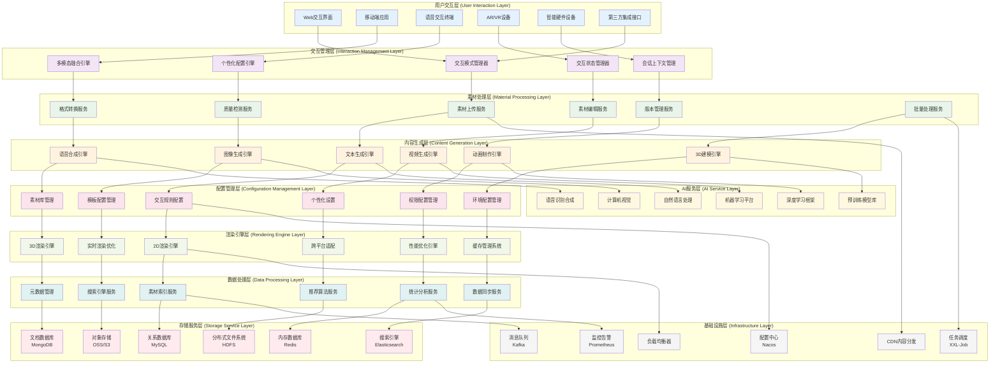
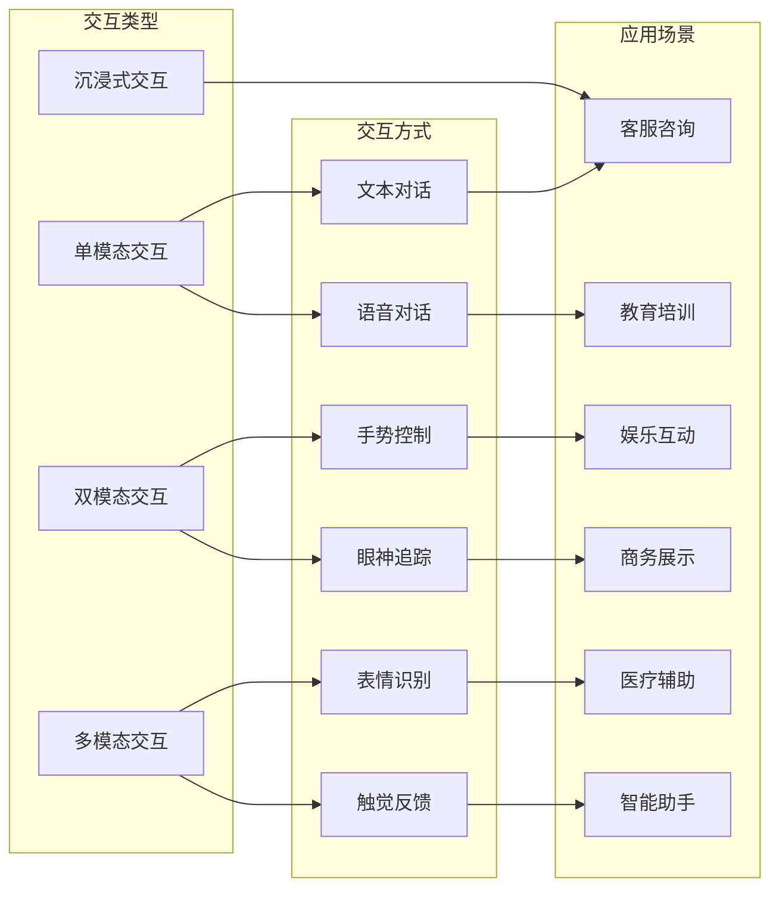
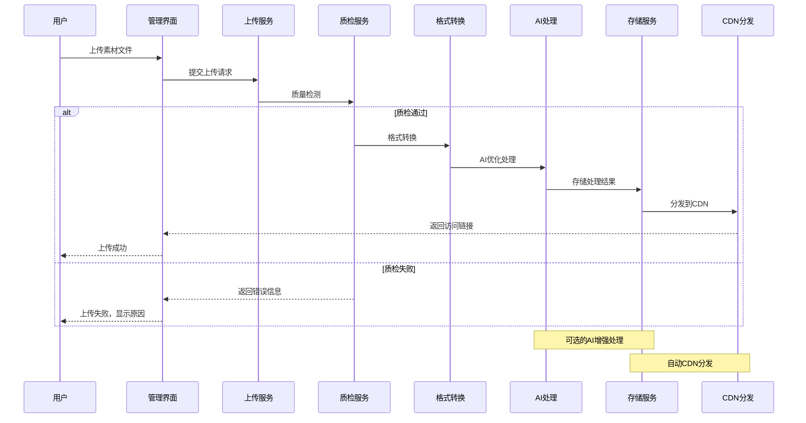
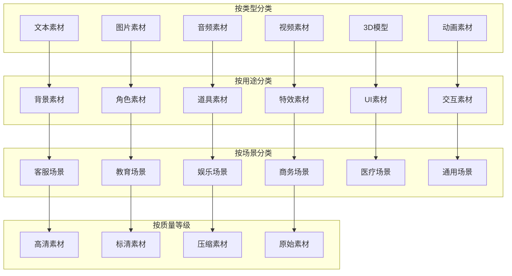
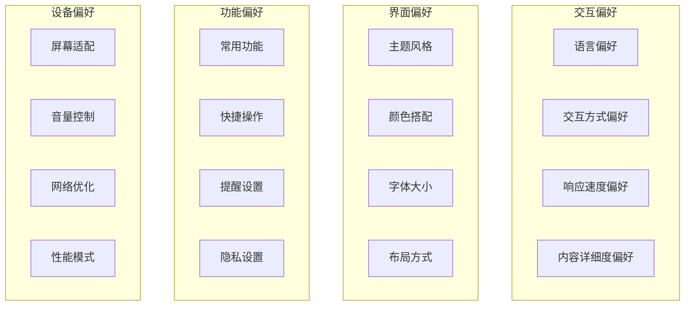
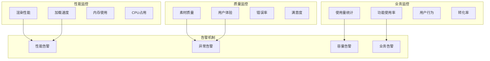

# 24.2.4 互动方式与素材配置功能架构图

## 系统概述
互动方式与素材配置功能负责管理数字人的各种交互模式、多媒体素材资源以及个性化配置，为用户提供丰富多样的交互体验。

## 技术架构图

## 核心功能模块

### 1. 多模态交互管理
- **文本交互**: 自然语言对话处理
- **语音交互**: 语音识别与合成
- **视觉交互**: 手势识别、表情分析
- **触觉交互**: 触摸、震动反馈
- **混合交互**: 多模态融合交互

### 2. 素材资源管理
- **素材分类**: 按类型、用途、场景分类
- **版本控制**: 素材版本管理和回滚
- **质量检测**: 自动化质量检测和优化
- **格式转换**: 多格式自动转换
- **批量操作**: 批量上传、处理、管理

### 3. 个性化配置
- **用户偏好**: 个性化交互偏好设置
- **场景适配**: 不同场景下的配置切换
- **设备适配**: 多设备适配配置
- **主题定制**: 界面主题和风格定制
- **交互规则**: 自定义交互规则和流程

### 4. 内容智能生成
- **AI文本生成**: 智能文案生成
- **语音合成**: 多语言、多音色语音合成
- **图像生成**: AI图像创作和编辑
- **视频制作**: 自动化视频生成和剪辑
- **3D建模**: 智能3D模型生成

## 交互模式架构

## 素材处理流程

## 素材分类体系

## 个性化配置体系

### 1. 用户偏好配置

### 2. 动态配置管理
- **热更新机制**: 配置实时生效，无需重启
- **版本管理**: 配置版本控制和回滚
- **环境隔离**: 开发、测试、生产环境配置隔离
- **权限控制**: 分级权限管理，确保安全

## 渲染优化策略

### 1. 性能优化
- **LOD技术**: 根据距离调整模型细节
- **遮挡剔除**: 剔除不可见物体减少渲染负载
- **批处理**: 合并渲染调用减少开销
- **纹理压缩**: 智能纹理压缩减少内存占用

### 2. 跨平台适配
- **自适应渲染**: 根据设备性能调整渲染质量
- **分辨率适配**: 多分辨率自动适配
- **格式兼容**: 多格式素材兼容处理
- **性能分级**: 不同性能设备分级处理

## AI增强功能

### 1. 智能素材处理
- **图像增强**: AI图像超分辨率、降噪
- **音频优化**: 音频降噪、音质提升
- **视频优化**: 视频稳定、画质增强
- **内容理解**: 智能标签、分类

### 2. 智能内容生成
- **文本生成**: 基于上下文的智能文本生成
- **图像生成**: 文本到图像的AI生成
- **语音克隆**: 个性化语音合成
- **动画生成**: 智能动画序列生成

## 监控与运维

## 技术特性

### 高性能处理
- 分布式处理架构
- GPU加速计算
- 智能缓存策略
- 异步处理机制

### 高可用保障
- 多地域部署
- 故障自动切换
- 数据备份恢复
- 服务降级策略

### 安全性保障
- 素材版权保护
- 数据传输加密
- 访问权限控制
- 审计日志记录

### 扩展性设计
- 微服务架构
- 插件化扩展
- API标准化
- 云原生部署