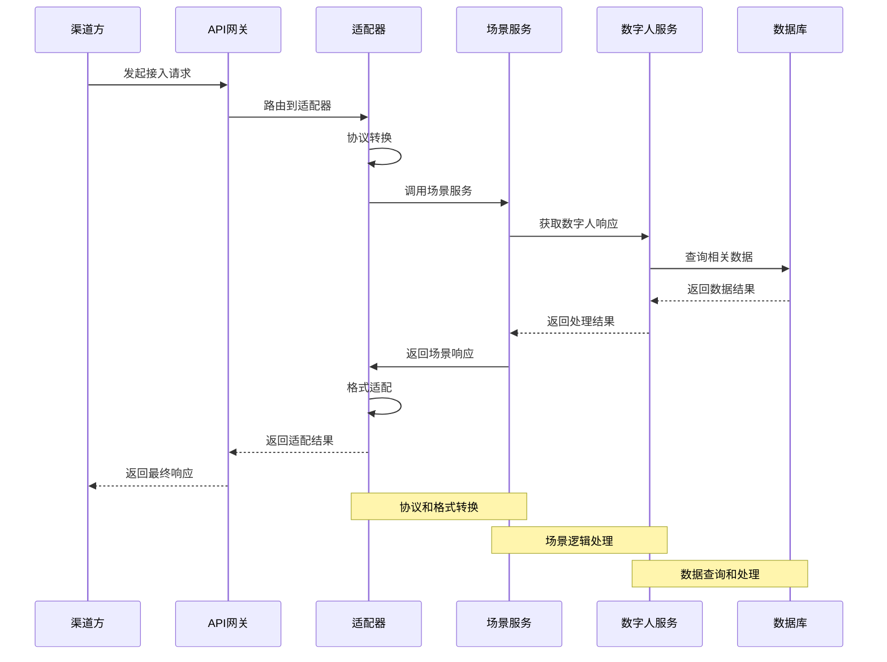
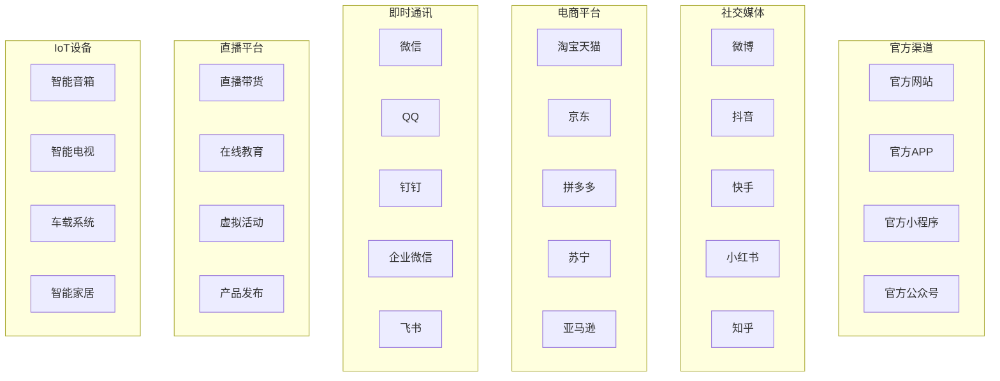
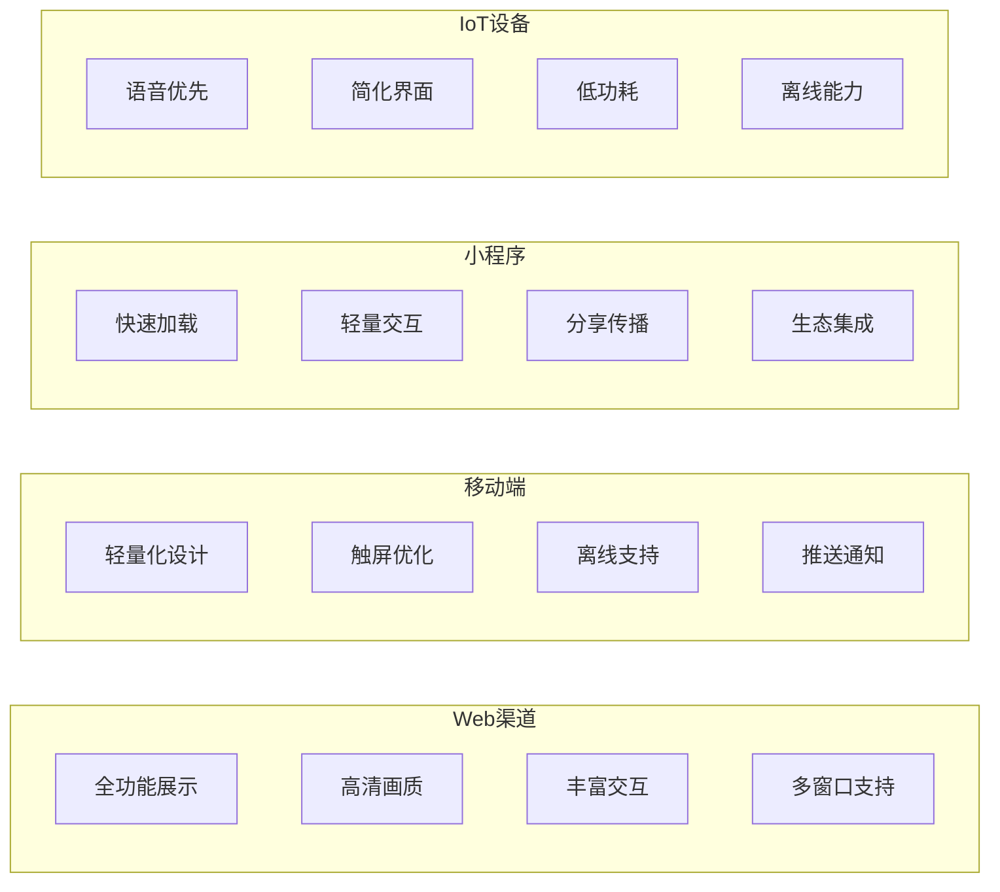
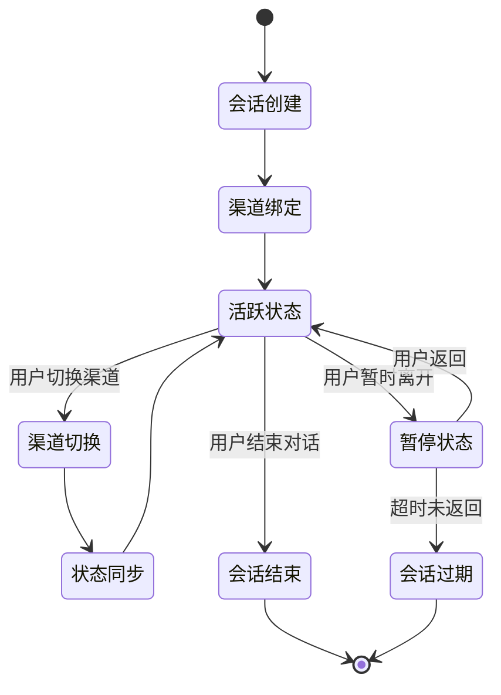
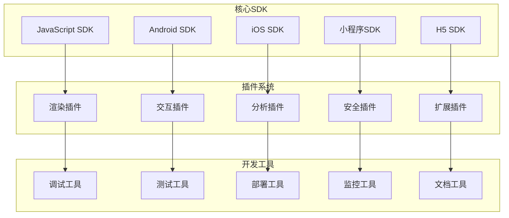
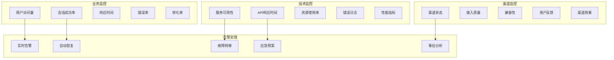

# 24.2.5 线上场景与触点扩展功能架构图

## 系统概述
线上场景与触点扩展功能负责数字人系统在各种线上渠道的部署、集成和扩展，实现全渠道的数字人服务覆盖和统一管理。

## 技术架构图

```mermaid
graph TB
    %% 触点接入层
    subgraph "触点接入层 (Touchpoint Access Layer)"
        A1[官方网站]
        A2[移动应用]
        A3[微信生态]
        A4[支付宝小程序]
        A5[抖音/快手]
        A6[电商平台]
        A7[社交媒体]
        A8[智能客服]
        A9[直播平台]
        A10[IoT设备]
    end

    %% 渠道适配层
    subgraph "渠道适配层 (Channel Adaptation Layer)"
        B1[Web SDK]
        B2[移动端SDK]
        B3[小程序SDK]
        B4[H5适配器]
        B5[API网关]
        B6[Webhook服务]
        B7[直播插件]
        B8[IoT适配器]
    end

    %% 场景编排层
    subgraph "场景编排层 (Scene Orchestration Layer)"
        C1[场景路由器]
        C2[上下文管理器]
        C3[会话管理器]
        C4[状态同步器]
        C5[跨渠道协调器]
        C6[个性化引擎]
    end

    %% 数字人服务层
    subgraph "数字人服务层 (Digital Human Service Layer)"
        D1[对话服务]
        D2[形象渲染服务]
        D3[语音服务]
        D4[情感计算服务]
        D5[知识服务]
        D6[推荐服务]
    end

    %% 业务逻辑层
    subgraph "业务逻辑层 (Business Logic Layer)"
        E1[用户管理]
        E2[权限控制]
        E3[业务规则引擎]
        E4[工作流引擎]
        E5[事件处理器]
        E6[数据处理器]
    end

    %% 集成服务层
    subgraph "集成服务层 (Integration Service Layer)"
        F1[CRM集成]
        F2[ERP集成]
        F3[支付集成]
        F4[物流集成]
        F5[营销系统集成]
        F6[数据分析集成]
        F7[第三方API集成]
    end

    %% 数据管理层
    subgraph "数据管理层 (Data Management Layer)"
        G1[用户数据管理]
        G2[会话数据管理]
        G3[业务数据管理]
        G4[行为数据管理]
        G5[内容数据管理]
        G6[统计数据管理]
    end

    %% 数据存储层
    subgraph "数据存储层 (Data Storage Layer)"
        H1[(MySQL\n用户数据)]
        H2[(MongoDB\n会话记录)]
        H3[(Redis\n缓存数据)]
        H4[(InfluxDB\n监控数据)]
        H5[(ElasticSearch\n搜索数据)]
        H6[对象存储\nOSS/S3]
        H7[(ClickHouse\n分析数据)]
    end

    %% 基础设施层
    subgraph "基础设施层 (Infrastructure Layer)"
        I1[负载均衡\nNginx/HAProxy]
        I2[消息队列\nKafka/RocketMQ]
        I3[任务调度\nXXL-Job]
        I4[配置中心\nNacos/Apollo]
        I5[服务发现\nConsul/Eureka]
        I6[监控告警\nPrometheus/Grafana]
        I7[链路追踪\nJaeger/SkyWalking]
        I8[日志系统\nELK Stack]
    end

    %% 连接关系
    A1 --> B1
    A2 --> B2
    A3 --> B3
    A4 --> B4
    A5 --> B5
    A6 --> B6
    A7 --> B7
    A8 --> B8
    A9 --> B1
    A10 --> B8
    
    B1 --> C1
    B2 --> C2
    B3 --> C3
    B4 --> C4
    B5 --> C5
    B6 --> C6
    B7 --> C1
    B8 --> C2
    
    C1 --> D1
    C2 --> D2
    C3 --> D3
    C4 --> D4
    C5 --> D5
    C6 --> D6
    
    D1 --> E1
    D2 --> E2
    D3 --> E3
    D4 --> E4
    D5 --> E5
    D6 --> E6
    
    E1 --> F1
    E2 --> F2
    E3 --> F3
    E4 --> F4
    E5 --> F5
    E6 --> F6
    E6 --> F7
    
    F1 --> G1
    F2 --> G2
    F3 --> G3
    F4 --> G4
    F5 --> G5
    F6 --> G6
    F7 --> G1
    
    G1 --> H1
    G2 --> H2
    G3 --> H3
    G4 --> H4
    G5 --> H5
    G6 --> H6
    G6 --> H7
    
    C1 --> I1
    D1 --> I2
    E4 --> I3
    C6 --> I4
    D1 --> I5
    G6 --> I6
    D1 --> I7
    E5 --> I8

    %% 样式定义
    classDef touchpoint fill:#e3f2fd
    classDef adaptation fill:#f3e5f5
    classDef orchestration fill:#e8f5e8
    classDef service fill:#fff3e0
    classDef business fill:#fce4ec
    classDef integration fill:#f1f8e9
    classDef datamanagement fill:#e0f2f1
    classDef storage fill:#ffebee
    classDef infrastructure fill:#f5f5f5

    class A1,A2,A3,A4,A5,A6,A7,A8,A9,A10 touchpoint
    class B1,B2,B3,B4,B5,B6,B7,B8 adaptation
    class C1,C2,C3,C4,C5,C6 orchestration
    class D1,D2,D3,D4,D5,D6 service
    class E1,E2,E3,E4,E5,E6 business
    class F1,F2,F3,F4,F5,F6,F7 integration
    class G1,G2,G3,G4,G5,G6 datamanagement
    class H1,H2,H3,H4,H5,H6,H7 storage
    class I1,I2,I3,I4,I5,I6,I7,I8 infrastructure
```

## 核心功能模块

### 1. 全渠道触点管理
- **渠道接入**: 支持主流线上渠道快速接入
- **统一标准**: 标准化的接入协议和SDK
- **动态配置**: 渠道参数动态配置和管理
- **监控管理**: 实时监控各渠道运行状态

### 2. 跨渠道场景编排
- **场景路由**: 智能路由用户到合适的服务场景
- **上下文保持**: 跨渠道会话上下文无缝传递
- **状态同步**: 用户状态跨渠道实时同步
- **个性化适配**: 根据渠道特性个性化适配

### 3. 渠道适配与优化
- **协议适配**: 适配不同渠道的通信协议
- **格式转换**: 多媒体格式自动转换
- **性能优化**: 针对不同渠道优化性能
- **兼容性保障**: 确保跨平台兼容性

### 4. 统一数据管理
- **数据整合**: 多渠道数据统一整合
- **用户画像**: 跨渠道用户画像构建
- **行为分析**: 全渠道用户行为分析
- **效果评估**: 渠道效果统计和评估

## 渠道接入流程

## 渠道分类架构

## 场景适配策略

### 1. 渠道特性适配

### 2. 内容适配机制
- **格式适配**: 根据渠道支持的格式自动转换
- **尺寸适配**: 自动适配不同屏幕尺寸和分辨率
- **带宽适配**: 根据网络状况调整内容质量
- **功能适配**: 根据渠道能力启用相应功能

## 跨渠道协调机制

### 1. 会话管理

### 2. 数据同步策略
- **实时同步**: 关键状态数据实时同步
- **异步同步**: 非关键数据异步批量同步
- **增量同步**: 只同步变化的数据
- **冲突解决**: 数据冲突自动解决机制

## 扩展能力架构

### 1. SDK与插件体系

### 2. 第三方集成
- **标准API**: 提供标准化的集成API
- **Webhook支持**: 支持事件驱动的集成
- **认证授权**: OAuth2.0等标准认证协议
- **数据格式**: JSON、XML等标准数据格式

## 性能优化策略

### 1. 加载优化
- **CDN加速**: 全球CDN节点加速资源加载
- **缓存策略**: 多级缓存提高响应速度
- **懒加载**: 按需加载减少初始化时间
- **预加载**: 智能预加载提升用户体验

### 2. 渲染优化
- **服务端渲染**: SSR提高首屏加载速度
- **客户端渲染**: CSR提供更好的交互体验
- **混合渲染**: 根据场景选择最优渲染方式
- **增量渲染**: 只渲染变化的部分

### 3. 网络优化
- **HTTP/2**: 使用HTTP/2提高传输效率
- **压缩传输**: Gzip等压缩算法减少传输量
- **连接复用**: 复用连接减少建立开销
- **智能重试**: 网络异常时智能重试

## 监控与运维

## 安全保障体系

### 1. 接入安全
- **身份认证**: 渠道身份验证和授权
- **API限流**: 防止恶意调用和攻击
- **数据加密**: 传输数据端到端加密
- **签名验证**: 请求签名验证防篡改

### 2. 数据安全
- **敏感数据保护**: 个人信息脱敏处理
- **访问控制**: 细粒度权限控制
- **审计日志**: 完整的操作审计记录
- **合规检查**: 符合相关法规要求

### 3. 业务安全
- **风控系统**: 实时风险识别和控制
- **异常检测**: 异常行为自动检测
- **黑名单机制**: 恶意用户和IP拦截
- **应急响应**: 安全事件快速响应

## 技术特性

### 高可扩展性
- 微服务架构支持水平扩展
- 插件化设计支持功能扩展
- 标准化接口支持快速集成
- 云原生架构支持弹性伸缩

### 高可靠性
- 多活部署保障服务可用性
- 故障自动切换和恢复
- 数据备份和容灾机制
- 服务降级和熔断保护

### 高性能
- 分布式架构支持高并发
- 智能缓存提升响应速度
- 负载均衡优化资源利用
- 异步处理提高吞吐量