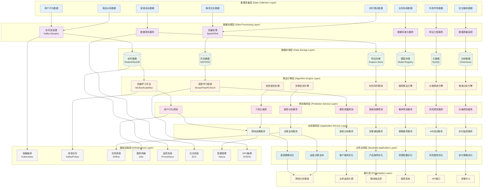
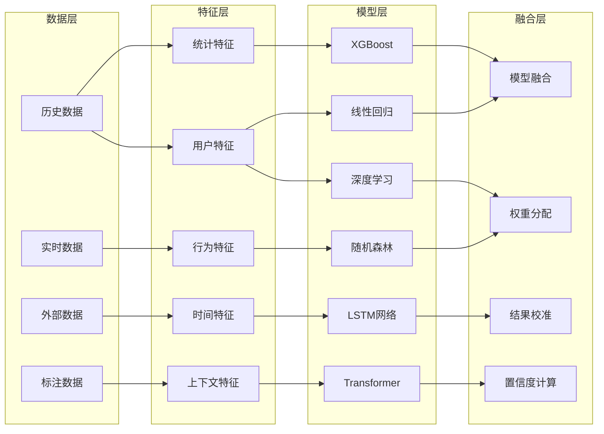
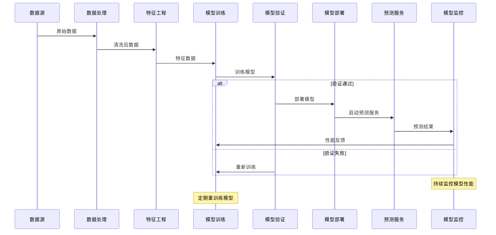
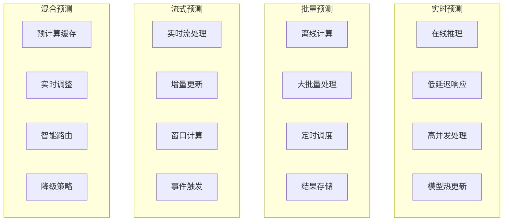
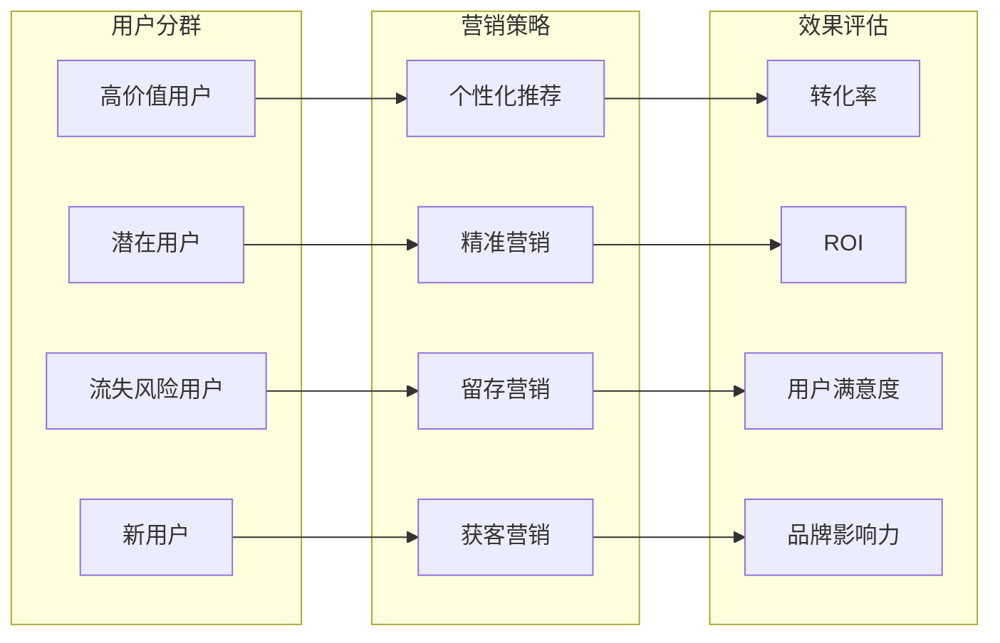
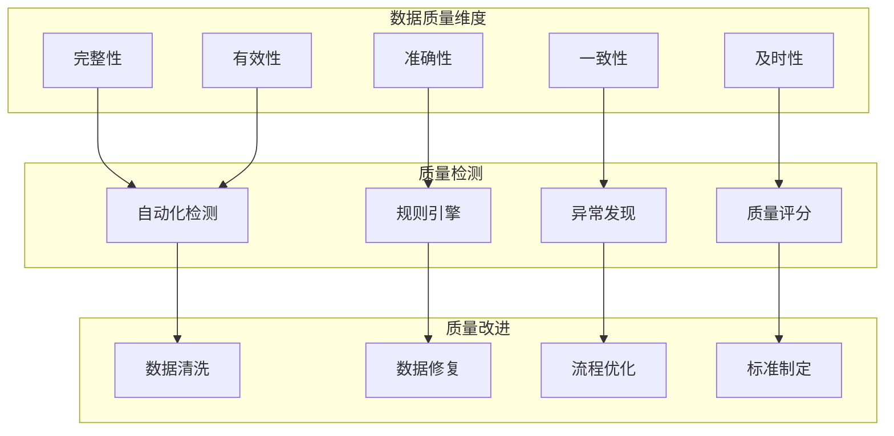
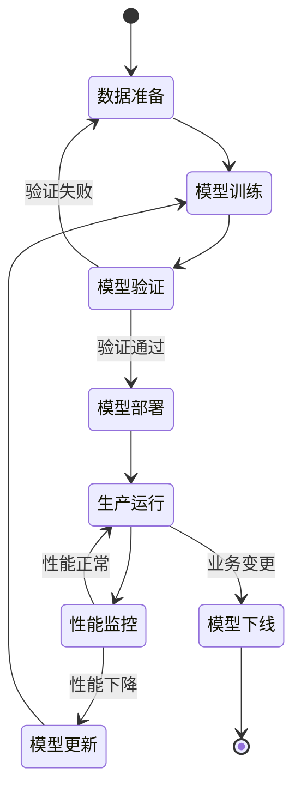

# 24.2.6 服务与营销预测功能架构图

## 系统概述
服务与营销预测功能基于大数据和AI技术，为数字人系统提供智能化的服务质量预测、营销效果预测、用户行为预测等能力，助力业务决策优化。

## 技术架构图

## 核心功能模块

### 1. 用户行为预测
- **购买意向预测**: 基于用户行为预测购买概率
- **流失风险预测**: 识别可能流失的用户
- **生命周期预测**: 预测用户生命周期价值
- **偏好预测**: 预测用户兴趣和偏好变化

### 2. 服务质量预测
- **响应时间预测**: 预测服务响应时间趋势
- **故障预测**: 预测系统故障和异常
- **容量预测**: 预测资源需求和容量规划
- **性能预测**: 预测系统性能变化趋势

### 3. 营销效果预测
- **ROI预测**: 预测营销活动投资回报率
- **转化率预测**: 预测营销活动转化效果
- **渠道效果预测**: 预测不同渠道的营销效果
- **用户获取成本预测**: 预测获客成本变化

### 4. 业务需求预测
- **销售预测**: 预测产品销售趋势
- **库存需求预测**: 优化库存管理
- **客服需求预测**: 预测客服工作负载
- **资源需求预测**: 预测IT资源需求

## 预测模型架构

## 机器学习流水线

## 预测服务类型

### 1. 实时预测服务

### 2. 预测精度优化
- **集成学习**: 多模型集成提高预测精度
- **在线学习**: 实时更新模型适应数据变化
- **特征选择**: 自动特征选择和重要性评估
- **超参数优化**: 自动调参提升模型性能

## 业务应用场景

### 1. 营销场景优化

### 2. 服务质量优化
- **资源预测**: 预测资源需求，提前扩容
- **故障预警**: 提前识别故障风险，主动处理
- **性能优化**: 基于预测结果优化系统性能
- **用户体验**: 预测用户需求，提升服务体验

### 3. 运营决策支持
- **需求预测**: 预测业务需求变化趋势
- **风险评估**: 识别和评估业务风险
- **投资决策**: 基于预测结果指导投资决策
- **战略规划**: 支持长期战略规划制定

## 数据治理体系

### 1. 数据质量管理

### 2. 数据安全与隐私
- **数据脱敏**: 敏感数据自动脱敏处理
- **访问控制**: 细粒度数据访问权限控制
- **审计日志**: 完整的数据访问审计记录
- **合规检查**: 符合数据保护法规要求

## 模型管理与运维

### 1. 模型生命周期管理

### 2. 模型监控指标
- **预测准确率**: 监控模型预测准确性
- **响应时间**: 监控模型推理响应时间
- **资源使用**: 监控CPU、内存、GPU使用情况
- **业务指标**: 监控业务相关的效果指标

### 3. 自动化运维
- **自动训练**: 定期自动重训练模型
- **自动部署**: 模型自动部署和版本管理
- **自动监控**: 自动监控模型性能和告警
- **自动回滚**: 性能异常时自动回滚到稳定版本

## 技术特性

### 高性能计算
- GPU集群支持大规模模型训练
- 分布式计算框架支持海量数据处理
- 模型压缩和量化技术优化推理性能
- 缓存机制提升预测服务响应速度

### 高可扩展性
- 微服务架构支持水平扩展
- 容器化部署支持弹性伸缩
- 插件化设计支持算法扩展
- 标准化接口支持系统集成

### 高可靠性
- 多副本部署保障服务可用性
- 故障自动切换和恢复
- 数据备份和灾难恢复
- 服务降级和熔断保护

### 智能化程度
- AutoML自动化机器学习
- 自动特征工程和选择
- 自动模型调优和选择
- 智能数据质量监控