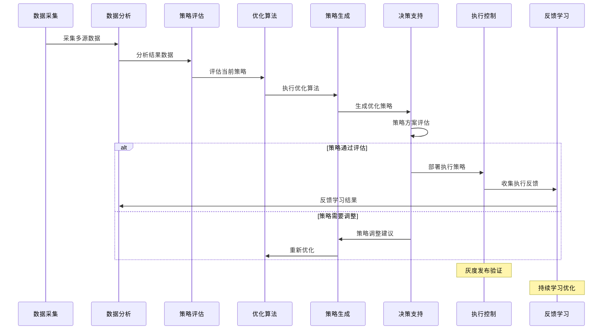
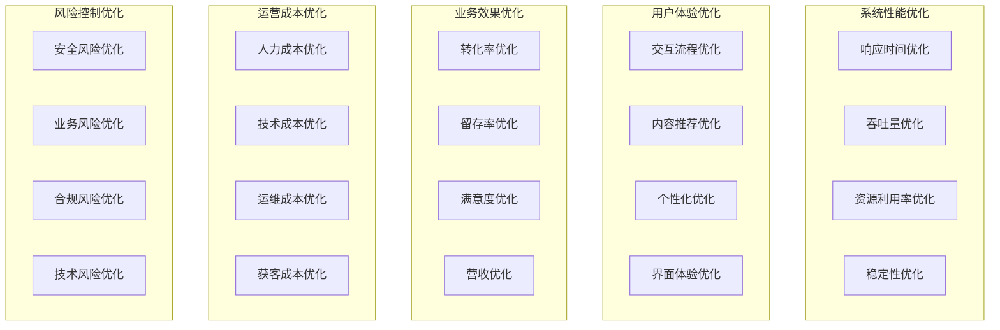
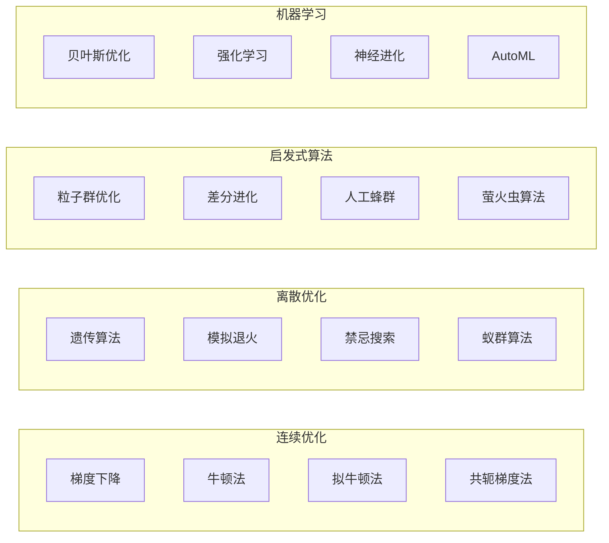
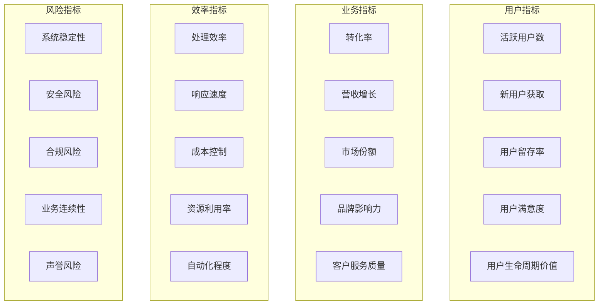
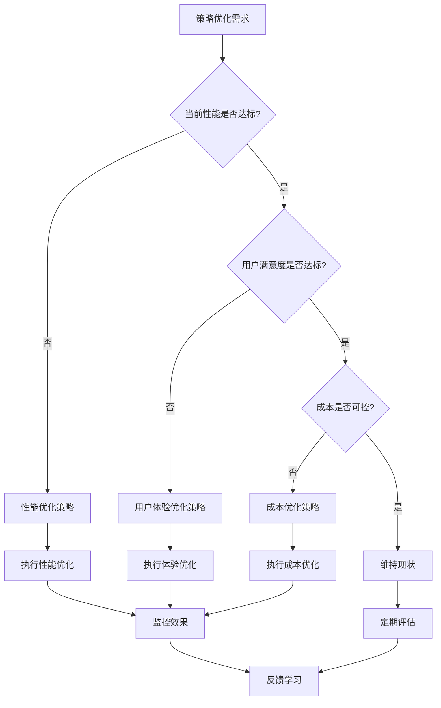
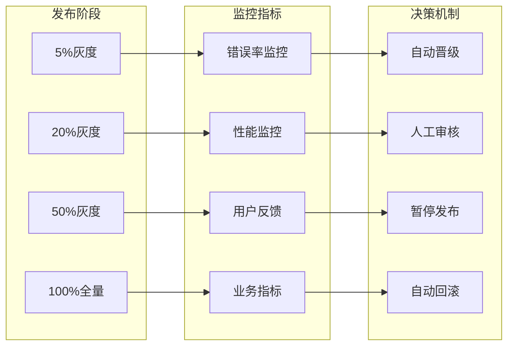

# 24.2.7 定期策略优化功能架构图

## 系统概述
定期策略优化功能通过数据驱动的方式，定期分析系统运行状况、用户反馈和业务指标，自动或半自动地优化数字人系统的各项策略，持续提升系统性能和用户体验。

## 技术架构图

```mermaid
graph TB
    %% 数据采集层
    subgraph "数据采集层 (Data Collection Layer)"
        A1[业务指标数据]
        A2[用户行为数据]
        A3[系统性能数据]
        A4[用户反馈数据]
        A5[市场竞品数据]
        A6[运营数据]
        A7[A/B测试数据]
        A8[外部环境数据]
    end

    %% 数据分析层
    subgraph "数据分析层 (Data Analysis Layer)"
        B1[指标计算引擎]
        B2[趋势分析引擎]
        B3[异常检测引擎]
        B4[相关性分析引擎]
        B5[对比分析引擎]
        B6[预测分析引擎]
    end

    %% 策略评估层
    subgraph "策略评估层 (Strategy Evaluation Layer)"
        C1[策略效果评估]
        C2[ROI分析计算]
        C3[风险评估分析]
        C4[用户满意度评估]
        C5[竞争力分析]
        C6[合规性检查]
    end

    %% 优化算法层
    subgraph "优化算法层 (Optimization Algorithm Layer)"
        D1[遗传算法]
        D2[粒子群优化]
        D3[模拟退火算法]
        D4[强化学习算法]
        D5[贝叶斯优化]
        D6[多目标优化]
        D7[约束优化算法]
    end

    %% 策略生成层
    subgraph "策略生成层 (Strategy Generation Layer)"
        E1[参数优化策略]
        E2[规则调整策略]
        E3[模型更新策略]
        E4[资源配置策略]
        E5[用户体验策略]
        E6[营销策略]
        E7[风险控制策略]
    end

    %% 决策支持层
    subgraph "决策支持层 (Decision Support Layer)"
        F1[策略推荐引擎]
        F2[影响评估系统]
        F3[决策树生成器]
        F4[方案对比分析]
        F5[风险预警系统]
        F6[执行计划生成]
    end

    %% 执行控制层
    subgraph "执行控制层 (Execution Control Layer)"
        G1[策略部署服务]
        G2[灰度发布控制]
        G3[回滚机制]
        G4[执行监控]
        G5[效果跟踪]
        G6[异常处理]
    end

    %% 反馈学习层
    subgraph "反馈学习层 (Feedback Learning Layer)"
        H1[效果反馈收集]
        H2[学习算法更新]
        H3[知识库维护]
        H4[经验积累]
        H5[模式识别]
        H6[智能建议]
    end

    %% 管理界面层
    subgraph "管理界面层 (Management Interface Layer)"
        I1[策略管理控制台]
        I2[优化效果看板]
        I3[决策支持界面]
        I4[审批流程界面]
        I5[监控告警界面]
        I6[报表分析界面]
    end

    %% 基础设施层
    subgraph "基础设施层 (Infrastructure Layer)"
        J1[分布式计算\nSpark/Flink]
        J2[机器学习平台\nMLflow]
        J3[工作流引擎\nAirflow]
        J4[消息队列\nKafka]
        J5[时序数据库\nInfluxDB]
        J6[图数据库\nNeo4j]
        J7[配置中心\nNacos]
        J8[监控系统\nPrometheus]
    end

    %% 连接关系
    A1 --> B1
    A2 --> B2
    A3 --> B3
    A4 --> B4
    A5 --> B5
    A6 --> B6
    A7 --> B1
    A8 --> B2
    
    B1 --> C1
    B2 --> C2
    B3 --> C3
    B4 --> C4
    B5 --> C5
    B6 --> C6
    
    C1 --> D1
    C2 --> D2
    C3 --> D3
    C4 --> D4
    C5 --> D5
    C6 --> D6
    
    D1 --> E1
    D2 --> E2
    D3 --> E3
    D4 --> E4
    D5 --> E5
    D6 --> E6
    D7 --> E7
    
    E1 --> F1
    E2 --> F2
    E3 --> F3
    E4 --> F4
    E5 --> F5
    E6 --> F6
    E7 --> F1
    
    F1 --> G1
    F2 --> G2
    F3 --> G3
    F4 --> G4
    F5 --> G5
    F6 --> G6
    
    G1 --> H1
    G2 --> H2
    G3 --> H3
    G4 --> H4
    G5 --> H5
    G6 --> H6
    
    H1 --> I1
    H2 --> I2
    H3 --> I3
    H4 --> I4
    H5 --> I5
    H6 --> I6
    
    B1 --> J1
    D1 --> J2
    F6 --> J3
    G4 --> J4
    A1 --> J5
    C5 --> J6
    G1 --> J7
    G4 --> J8

    %% 样式定义
    classDef collection fill:#e3f2fd
    classDef analysis fill:#f3e5f5
    classDef evaluation fill:#e8f5e8
    classDef optimization fill:#fff3e0
    classDef generation fill:#fce4ec
    classDef decision fill:#f1f8e9
    classDef execution fill:#e0f2f1
    classDef feedback fill:#fff8e1
    classDef interface fill:#ffebee
    classDef infrastructure fill:#f5f5f5

    class A1,A2,A3,A4,A5,A6,A7,A8 collection
    class B1,B2,B3,B4,B5,B6 analysis
    class C1,C2,C3,C4,C5,C6 evaluation
    class D1,D2,D3,D4,D5,D6,D7 optimization
    class E1,E2,E3,E4,E5,E6,E7 generation
    class F1,F2,F3,F4,F5,F6 decision
    class G1,G2,G3,G4,G5,G6 execution
    class H1,H2,H3,H4,H5,H6 feedback
    class I1,I2,I3,I4,I5,I6 interface
    class J1,J2,J3,J4,J5,J6,J7,J8 infrastructure
```

## 核心功能模块

### 1. 策略分析与评估
- **多维度指标分析**: 从业务、技术、用户等多个维度分析策略效果
- **趋势预测分析**: 基于历史数据预测策略发展趋势
- **对标分析**: 与行业标杆和竞品进行对比分析
- **ROI计算**: 精确计算策略投入产出比

### 2. 智能优化算法
- **多目标优化**: 同时优化多个相互冲突的目标
- **约束优化**: 在业务约束条件下寻找最优解
- **自适应优化**: 根据环境变化自动调整优化策略
- **强化学习**: 通过试错学习不断优化策略

### 3. 策略生成与推荐
- **智能参数调优**: 自动调整系统关键参数
- **规则智能生成**: 基于数据自动生成业务规则
- **个性化策略**: 为不同用户群体生成个性化策略
- **场景适配策略**: 针对不同场景生成适配策略

### 4. 执行与反馈闭环
- **灰度发布**: 策略渐进式部署和验证
- **实时监控**: 策略执行过程实时监控
- **自动回滚**: 异常情况下自动回滚到稳定版本
- **效果反馈**: 收集执行效果反馈持续优化

## 策略优化流程

## 优化策略分类

## 优化算法选择策略

### 1. 单目标优化

### 2. 多目标优化
- **NSGA-II**: 快速非支配排序遗传算法
- **MOEA/D**: 基于分解的多目标进化算法
- **SPEA2**: 强度帕累托进化算法
- **MOPSO**: 多目标粒子群优化算法

### 3. 约束优化
- **拉格朗日乘数法**: 处理等式约束优化
- **KKT条件**: 处理不等式约束优化
- **罚函数法**: 将约束转化为目标函数
- **内点法**: 约束优化的有效方法

## 策略评估指标体系

### 1. 业务指标

### 2. 技术指标
- **性能指标**: 响应时间、吞吐量、并发数
- **可用性指标**: 系统可用率、故障恢复时间
- **可扩展性指标**: 扩展能力、弹性伸缩效果
- **安全指标**: 安全事件数量、漏洞修复时间

## 智能决策支持

### 1. 决策树生成

### 2. 风险评估矩阵
- **高收益低风险**: 优先执行策略
- **高收益高风险**: 谨慎评估后执行
- **低收益低风险**: 资源充足时执行
- **低收益高风险**: 不建议执行

### 3. 方案对比分析
- **成本效益分析**: 对比不同方案的投入产出
- **风险收益分析**: 评估方案的风险和收益
- **时间效果分析**: 分析方案的短期和长期效果
- **资源需求分析**: 评估方案的资源需求

## 执行控制机制

### 1. 灰度发布策略

### 2. 异常处理机制
- **异常检测**: 实时检测策略执行异常
- **自动回滚**: 异常情况下自动回滚到稳定版本
- **告警通知**: 及时通知相关人员处理异常
- **应急预案**: 预定义的应急处理流程

## 学习与进化机制

### 1. 知识积累
- **策略知识库**: 积累历史成功策略经验
- **失败案例库**: 记录失败案例避免重复错误
- **最佳实践库**: 总结最佳实践供参考
- **专家经验库**: 整合专家经验和知识

### 2. 模式识别
- **成功模式识别**: 识别成功策略的共同模式
- **失败模式识别**: 识别失败策略的共同特征
- **环境模式识别**: 识别不同环境下的优化模式
- **用户模式识别**: 识别不同用户群体的偏好模式

### 3. 自适应学习
- **在线学习**: 实时学习和调整策略
- **迁移学习**: 将成功经验迁移到新场景
- **元学习**: 学习如何更好地学习和优化
- **强化学习**: 通过试错不断改进策略

## 技术特性

### 智能化水平
- AI驱动的自动优化
- 机器学习算法持续改进
- 智能决策支持系统
- 自适应策略调整

### 可扩展性
- 插件化优化算法
- 可配置的评估指标
- 灵活的执行策略
- 开放的集成接口

### 可靠性保障
- 多重安全检查机制
- 渐进式部署验证
- 自动回滚保护
- 完整的审计日志

### 用户友好性
- 可视化策略管理
- 直观的效果展示
- 简化的操作流程
- 智能的建议推荐