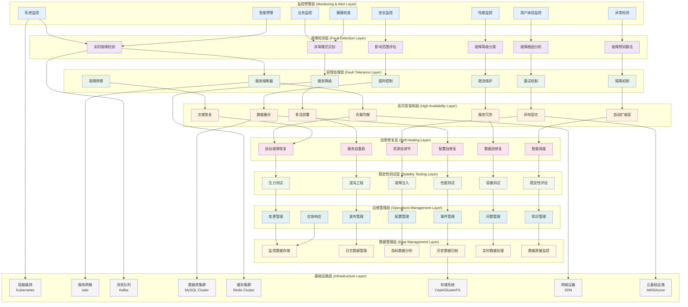
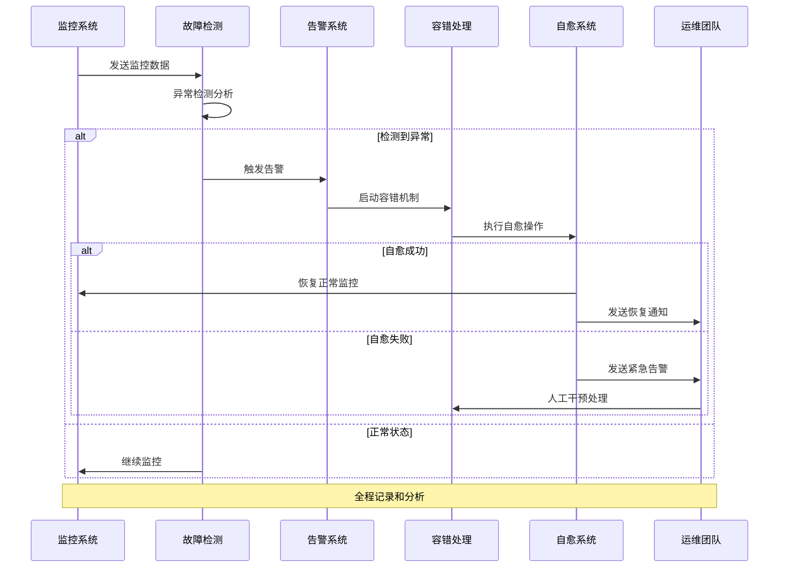
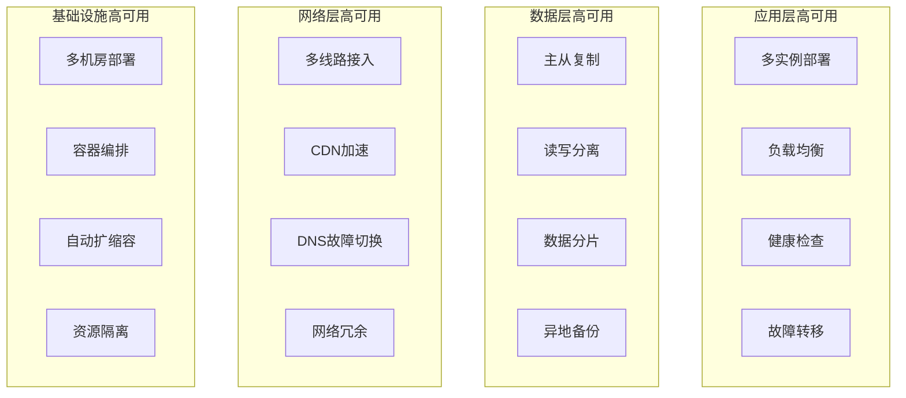
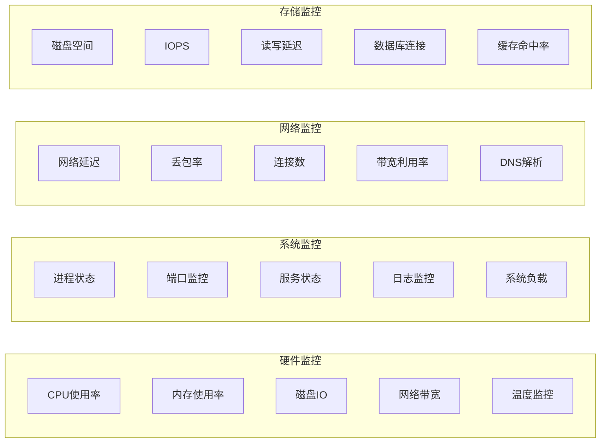
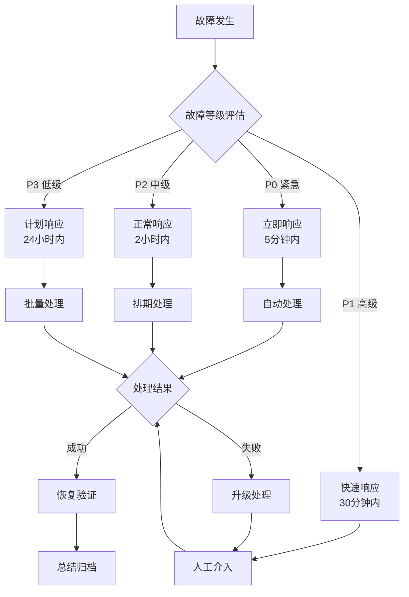
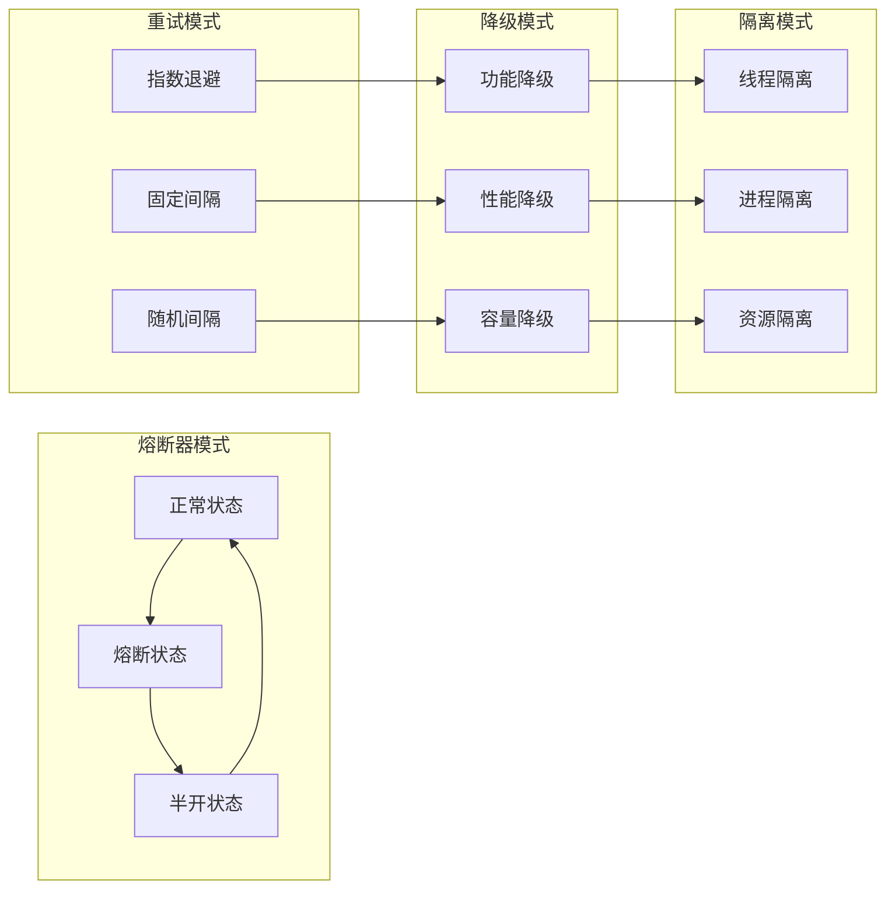
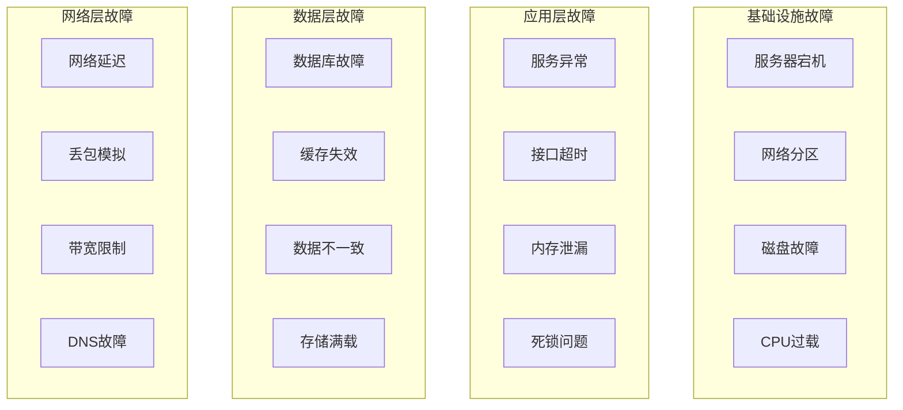
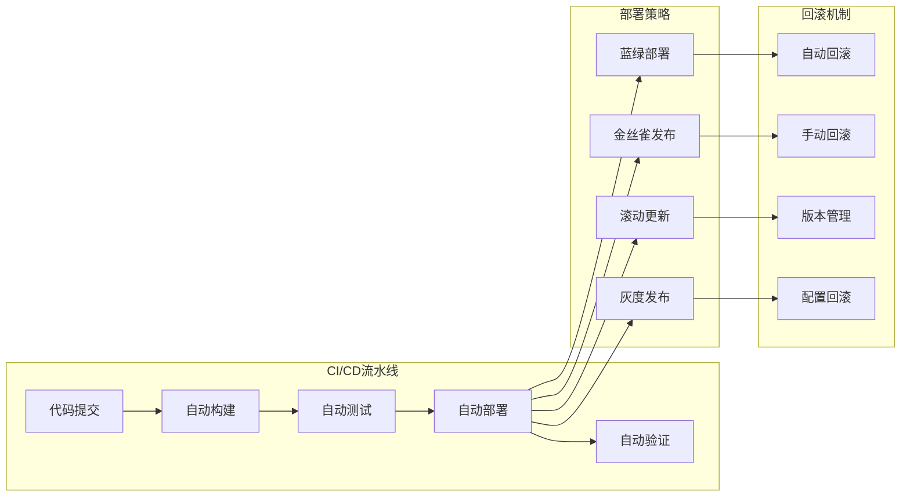

# 24.2.8 稳定性提升功能架构图

## 系统概述
稳定性提升功能架构专注于提高数字人系统的可用性、可靠性和容错能力，通过多层次的稳定性保障机制，确保系统在各种异常情况下都能稳定运行。

## 技术架构图

## 核心功能模块

### 1. 全方位监控体系
- **系统监控**: CPU、内存、磁盘、网络等基础设施监控
- **应用监控**: 应用性能、响应时间、错误率监控
- **业务监控**: 关键业务指标和用户体验监控
- **安全监控**: 安全事件、异常访问、威胁检测

### 2. 智能故障检测
- **实时检测**: 毫秒级故障检测和响应
- **模式识别**: 基于机器学习的异常模式识别
- **根因分析**: 自动分析故障根本原因
- **预测性维护**: 预测潜在故障并提前处理

### 3. 多层次容错机制
- **服务级容错**: 熔断、降级、重试、超时控制
- **系统级容错**: 故障隔离、资源隔离、故障转移
- **数据级容错**: 数据备份、数据一致性保障
- **网络级容错**: 网络冗余、链路切换

### 4. 自动化运维
- **自动扩缩容**: 根据负载自动调整资源
- **自动故障恢复**: 故障自动检测和恢复
- **自动部署**: 自动化部署和回滚
- **自动配置**: 配置自动同步和修复

## 稳定性保障流程

## 高可用架构设计

### 1. 多层次高可用

### 2. 容灾架构
- **同城双活**: 同城多机房双活部署
- **异地容灾**: 异地灾备中心建设
- **云端容灾**: 混合云容灾方案
- **数据同步**: 实时数据同步和一致性保障

## 监控指标体系

### 1. 基础设施监控

### 2. 应用性能监控
- **响应时间**: API响应时间分布统计
- **吞吐量**: 每秒请求数和处理能力
- **错误率**: 各种错误类型的统计分析
- **用户体验**: 页面加载时间、交互响应时间

### 3. 业务指标监控
- **用户活跃度**: 在线用户数、活跃用户数
- **业务成功率**: 关键业务流程成功率
- **转化漏斗**: 业务转化各环节监控
- **收入指标**: 实时收入和业务价值监控

## 故障处理机制

### 1. 故障分级处理

### 2. 自动化故障恢复
- **服务重启**: 异常服务自动重启
- **实例替换**: 故障实例自动替换
- **流量切换**: 故障节点流量自动切换
- **资源调整**: 资源不足时自动扩容

### 3. 人工干预机制
- **告警升级**: 自动处理失败时人工介入
- **专家支持**: 复杂问题专家团队支持
- **应急预案**: 预定义应急处理流程
- **决策支持**: 基于数据的决策支持

## 容错设计模式

### 1. 服务容错模式

### 2. 数据容错模式
- **数据复制**: 多副本数据保护
- **数据分片**: 数据分片降低风险
- **一致性保障**: 分布式一致性算法
- **数据修复**: 自动数据修复机制

## 混沌工程实践

### 1. 故障注入策略

### 2. 混沌实验设计
- **假设驱动**: 基于假设设计实验
- **小范围验证**: 从小范围开始逐步扩大
- **安全机制**: 实验安全退出机制
- **结果分析**: 详细的实验结果分析

## 性能优化策略

### 1. 系统性能优化
- **资源优化**: CPU、内存、IO资源优化
- **算法优化**: 关键算法性能优化
- **缓存策略**: 多级缓存提升性能
- **数据库优化**: 索引、查询、连接池优化

### 2. 架构性能优化
- **微服务拆分**: 合理的服务拆分和组合
- **异步处理**: 异步消息处理提升吞吐
- **读写分离**: 数据库读写分离
- **CDN加速**: 静态资源CDN加速

### 3. 网络性能优化
- **连接复用**: HTTP/2、连接池
- **数据压缩**: 传输数据压缩
- **协议优化**: 选择合适的通信协议
- **负载均衡**: 智能负载均衡算法

## 运维自动化

### 1. 自动化部署

### 2. 自动化运维
- **配置管理**: 配置自动同步和验证
- **补丁管理**: 安全补丁自动更新
- **备份管理**: 自动备份和恢复验证
- **清理任务**: 日志清理、临时文件清理

## 安全稳定性

### 1. 安全防护
- **DDoS防护**: 分布式拒绝服务攻击防护
- **Web防护**: SQL注入、XSS等Web攻击防护
- **访问控制**: 基于角色的访问控制
- **数据加密**: 传输和存储数据加密

### 2. 合规性保障
- **审计日志**: 完整的操作审计记录
- **合规检查**: 自动化合规性检查
- **数据保护**: 个人数据保护机制
- **风险评估**: 定期安全风险评估

## 技术特性

### 高可靠性
- 99.99%系统可用性保障
- 故障自动检测和恢复
- 多层次容错机制
- 完善的备份和恢复

### 高性能
- 毫秒级故障检测
- 秒级故障恢复
- 高并发处理能力
- 智能资源调度

### 高扩展性
- 弹性扩缩容
- 水平扩展支持
- 模块化设计
- 标准化接口

### 智能化运维
- AI驱动的异常检测
- 智能故障预测
- 自动化运维流程
- 智能决策支持