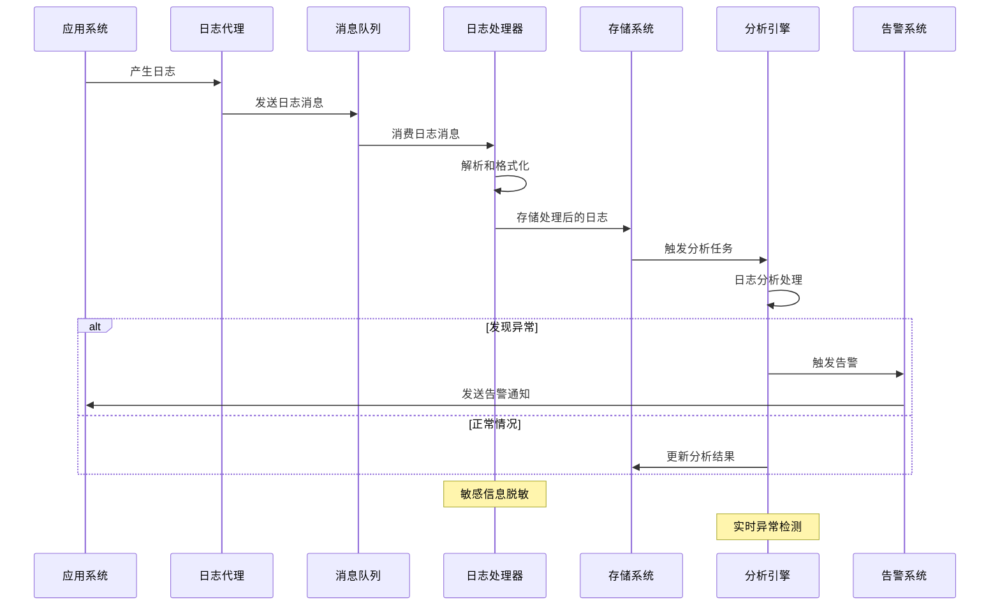
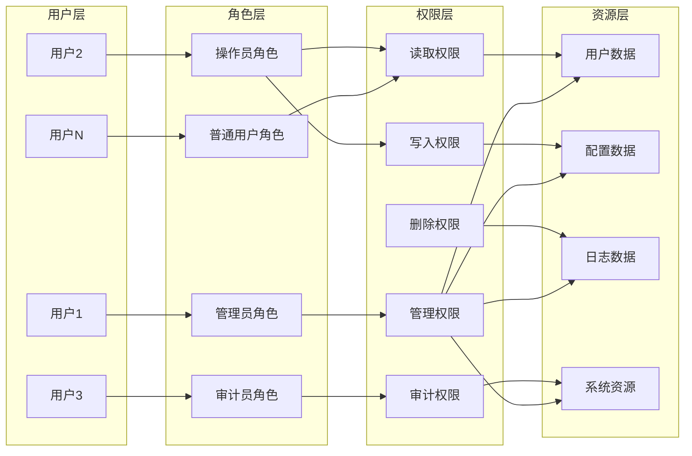
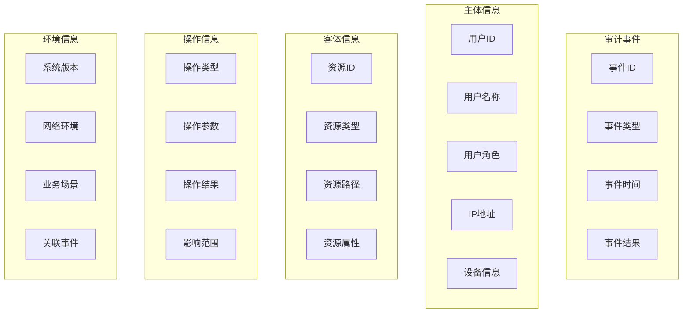
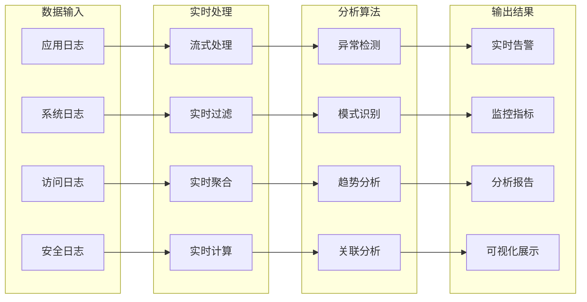
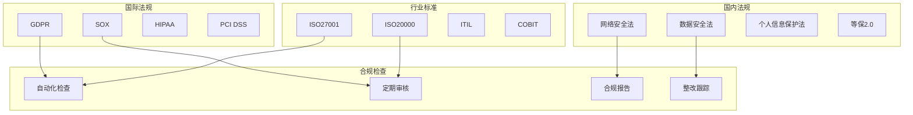

# 24.2.9 日志与权限建设功能架构图

## 系统概述
日志与权限建设功能为数字人系统提供全面的日志管理、权限控制、审计追踪和合规保障能力，确保系统安全性、可追溯性和合规性。

## 技术架构图

```mermaid
graph TB
    %% 日志采集层
    subgraph "日志采集层 (Log Collection Layer)"
        A1[应用日志采集]
        A2[系统日志采集]
        A3[访问日志采集]
        A4[安全日志采集]
        A5[业务日志采集]
        A6[审计日志采集]
        A7[性能日志采集]
        A8[错误日志采集]
    end

    %% 日志处理层
    subgraph "日志处理层 (Log Processing Layer)"
        B1[日志解析器]
        B2[日志过滤器]
        B3[日志格式化]
        B4[日志聚合器]
        B5[日志分类器]
        B6[日志增强器]
        B7[敏感信息脱敏]
    end

    %% 权限管理层
    subgraph "权限管理层 (Permission Management Layer)"
        C1[用户管理]
        C2[角色管理]
        C3[权限定义]
        C4[资源管理]
        C5[策略引擎]
        C6[权限分配]
        C7[权限继承]
        C8[动态权限]
    end

    %% 访问控制层
    subgraph "访问控制层 (Access Control Layer)"
        D1[身份认证]
        D2[单点登录SSO]
        D3[多因子认证MFA]
        D4[授权验证]
        D5[会话管理]
        D6[访问决策]
        D7[权限缓存]
    end

    %% 审计监控层
    subgraph "审计监控层 (Audit & Monitoring Layer)"
        E1[操作审计]
        E2[访问审计]
        E3[权限变更审计]
        E4[数据访问审计]
        E5[异常行为监控]
        E6[合规性检查]
        E7[风险评估]
    end

    %% 数据存储层
    subgraph "数据存储层 (Data Storage Layer)"
        F1[日志存储\nElasticsearch]
        F2[权限数据库\nMySQL]
        F3[审计数据库\nPostgreSQL]
        F4[缓存存储\nRedis]
        F5[文件存储\nHDFS/S3]
        F6[时序数据库\nInfluxDB]
    end

    %% 分析处理层
    subgraph "分析处理层 (Analytics Layer)"
        G1[日志分析引擎]
        G2[行为分析引擎]
        G3[异常检测引擎]
        G4[统计分析引擎]
        G5[报表生成引擎]
        G6[智能告警引擎]
    end

    %% 可视化展示层
    subgraph "可视化展示层 (Visualization Layer)"
        H1[日志查询界面]
        H2[权限管理界面]
        H3[审计报告界面]
        H4[监控大屏]
        H5[告警中心]
        H6[合规报告]
    end

    %% 集成接口层
    subgraph "集成接口层 (Integration Layer)"
        I1[API接口]
        I2[SDK工具包]
        I3[Webhook接口]
        I4[消息队列接口]
        I5[第三方集成]
        I6[标准协议支持]
    end

    %% 基础设施层
    subgraph "基础设施层 (Infrastructure Layer)"
        J1[消息队列\nKafka/RabbitMQ]
        J2[流处理引擎\nStorm/Flink]
        J3[任务调度\nQuartz/XXL-Job]
        J4[配置中心\nNacos/Apollo]
        J5[服务发现\nConsul/Eureka]
        J6[负载均衡\nNginx/HAProxy]
    end

    %% 连接关系
    A1 --> B1
    A2 --> B2
    A3 --> B3
    A4 --> B4
    A5 --> B5
    A6 --> B6
    A7 --> B7
    A8 --> B1
    
    B1 --> F1
    B2 --> F1
    B3 --> F1
    B4 --> F1
    B5 --> F1
    B6 --> F1
    B7 --> F1
    
    C1 --> F2
    C2 --> F2
    C3 --> F2
    C4 --> F2
    C5 --> F4
    C6 --> F4
    C7 --> F2
    C8 --> F4
    
    D1 --> C1
    D2 --> C2
    D3 --> C3
    D4 --> C5
    D5 --> F4
    D6 --> C5
    D7 --> F4
    
    E1 --> F3
    E2 --> F3
    E3 --> F3
    E4 --> F3
    E5 --> F6
    E6 --> F3
    E7 --> F6
    
    F1 --> G1
    F2 --> G2
    F3 --> G3
    F4 --> G4
    F5 --> G5
    F6 --> G6
    
    G1 --> H1
    G2 --> H2
    G3 --> H3
    G4 --> H4
    G5 --> H5
    G6 --> H6
    
    H1 --> I1
    H2 --> I2
    H3 --> I3
    H4 --> I4
    H5 --> I5
    H6 --> I6
    
    B1 --> J1
    G1 --> J2
    E6 --> J3
    C5 --> J4
    D1 --> J5
    I1 --> J6

    %% 样式定义
    classDef collection fill:#e3f2fd
    classDef processing fill:#f3e5f5
    classDef permission fill:#e8f5e8
    classDef access fill:#fff3e0
    classDef audit fill:#fce4ec
    classDef storage fill:#f1f8e9
    classDef analytics fill:#e0f2f1
    classDef visualization fill:#fff8e1
    classDef integration fill:#ffebee
    classDef infrastructure fill:#f5f5f5

    class A1,A2,A3,A4,A5,A6,A7,A8 collection
    class B1,B2,B3,B4,B5,B6,B7 processing
    class C1,C2,C3,C4,C5,C6,C7,C8 permission
    class D1,D2,D3,D4,D5,D6,D7 access
    class E1,E2,E3,E4,E5,E6,E7 audit
    class F1,F2,F3,F4,F5,F6 storage
    class G1,G2,G3,G4,G5,G6 analytics
    class H1,H2,H3,H4,H5,H6 visualization
    class I1,I2,I3,I4,I5,I6 integration
    class J1,J2,J3,J4,J5,J6 infrastructure
```

## 核心功能模块

### 1. 日志管理系统
- **全链路日志采集**: 从应用到基础设施的全方位日志采集
- **实时日志处理**: 流式处理和实时分析
- **智能日志分析**: AI驱动的日志异常检测和分析
- **日志生命周期管理**: 自动化的日志存储、归档和清理

### 2. 权限控制系统
- **细粒度权限控制**: 支持到字段级别的权限控制
- **基于角色的访问控制(RBAC)**: 灵活的角色权限管理
- **基于属性的访问控制(ABAC)**: 动态权限决策
- **权限继承和委派**: 支持权限的继承和临时委派

### 3. 身份认证系统
- **多种认证方式**: 用户名密码、短信验证、生物识别等
- **单点登录(SSO)**: 统一身份认证入口
- **多因子认证(MFA)**: 增强安全性的多重验证
- **联邦身份认证**: 支持SAML、OAuth2.0等标准协议

### 4. 审计监控系统
- **全面审计记录**: 记录所有关键操作和访问
- **实时监控告警**: 异常行为实时监控和告警
- **合规性检查**: 自动化的合规性检查和报告
- **风险评估**: 基于行为分析的风险评估

## 日志处理流程

## 权限模型设计

### 1. RBAC权限模型

### 2. ABAC权限模型
- **主体属性**: 用户身份、部门、级别等
- **客体属性**: 资源类型、敏感级别、所有者等
- **环境属性**: 时间、地点、网络等
- **动作属性**: 操作类型、操作方式等

### 3. 动态权限控制
- **上下文感知**: 根据上下文动态调整权限
- **时间限制**: 支持时间窗口的权限控制
- **地理位置**: 基于地理位置的访问控制
- **设备限制**: 基于设备类型的访问控制

## 审计体系架构

### 1. 审计数据模型

### 2. 审计事件分类
- **登录审计**: 用户登录、登出、会话管理
- **操作审计**: 数据增删改查、配置变更
- **权限审计**: 权限分配、回收、变更
- **系统审计**: 系统启停、配置变更、升级部署
- **数据审计**: 敏感数据访问、导出、传输
- **异常审计**: 安全事件、异常访问、违规操作

### 3. 审计数据保护
- **数据完整性**: 审计数据防篡改保护
- **数据机密性**: 敏感审计数据加密存储
- **数据可用性**: 审计数据高可用保障
- **数据备份**: 审计数据定期备份和恢复

## 日志分析与监控

### 1. 实时日志分析

### 2. 智能异常检测
- **基于规则的检测**: 预定义规则匹配异常
- **基于统计的检测**: 统计学方法检测异常
- **基于机器学习的检测**: ML算法自动检测异常
- **基于深度学习的检测**: 深度学习模型检测复杂异常

### 3. 日志关联分析
- **时间关联**: 基于时间窗口的事件关联
- **用户关联**: 基于用户行为的事件关联
- **系统关联**: 基于系统组件的事件关联
- **业务关联**: 基于业务流程的事件关联

## 合规性管理

### 1. 法规遵循

### 2. 数据保护
- **数据分类**: 按敏感程度分类管理
- **数据脱敏**: 敏感数据自动脱敏
- **数据加密**: 传输和存储加密保护
- **数据删除**: 数据生命周期管理和安全删除

### 3. 隐私保护
- **最小化原则**: 只采集必要的数据
- **用途限制**: 数据只用于声明的用途
- **知情同意**: 用户知情并同意数据使用
- **权利保障**: 保障用户数据相关权利

## 性能优化策略

### 1. 日志处理优化
- **批量处理**: 批量处理提高效率
- **异步处理**: 异步处理避免阻塞
- **压缩存储**: 日志数据压缩存储
- **分布式处理**: 分布式集群处理大量日志

### 2. 权限验证优化
- **权限缓存**: 热点权限数据缓存
- **预计算**: 权限结果预计算
- **并行验证**: 多个权限并行验证
- **智能路由**: 根据负载智能路由

### 3. 查询优化
- **索引优化**: 合理设计索引提高查询效率
- **分区存储**: 数据分区提高查询性能
- **缓存策略**: 查询结果缓存
- **读写分离**: 查询和写入分离处理

## 安全保障机制

### 1. 数据安全
- **传输加密**: HTTPS/TLS加密传输
- **存储加密**: 数据库和文件加密存储
- **访问控制**: 严格的数据访问控制
- **审计追踪**: 完整的数据访问审计

### 2. 系统安全
- **身份验证**: 强身份验证机制
- **权限最小化**: 最小权限原则
- **安全隔离**: 系统组件安全隔离
- **漏洞管理**: 定期安全漏洞扫描和修复

### 3. 运维安全
- **安全部署**: 安全的部署和配置
- **安全监控**: 实时安全监控和告警
- **应急响应**: 安全事件应急响应机制
- **安全培训**: 定期安全意识培训

## 技术特性

### 高性能处理
- 支持PB级日志数据处理
- 毫秒级权限验证响应
- 实时日志分析和告警
- 高并发访问控制

### 高可用性
- 分布式集群部署
- 多副本数据保护
- 故障自动切换
- 灾难恢复机制

### 高扩展性
- 水平扩展支持
- 微服务架构
- 插件化设计
- 标准化接口

### 高安全性
- 多层安全防护
- 数据加密保护
- 完整审计追踪
- 合规性保障